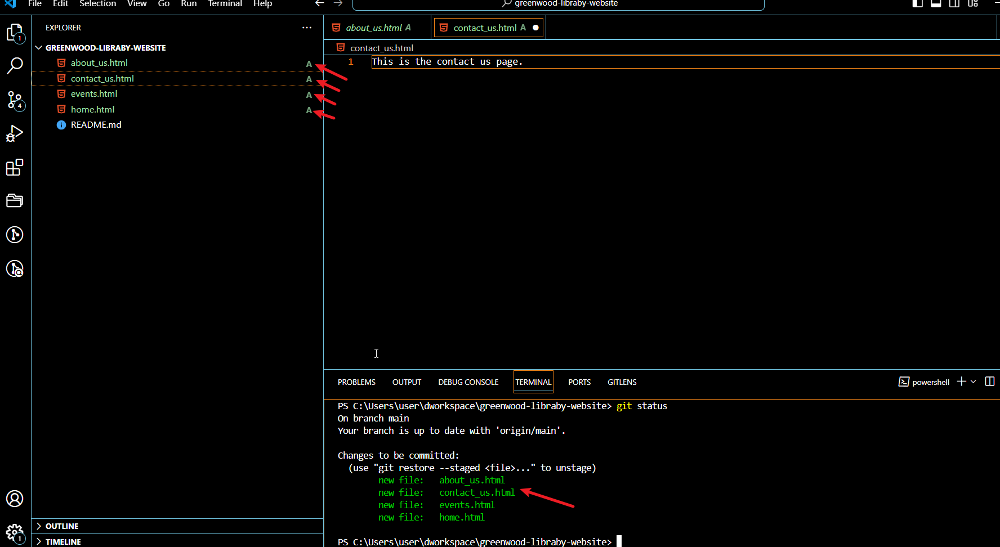

# **GIT PROJECT (Enhancing a Community's Library Website) **

## OBJECTIVES
- Practice cloning a repository and working with branches in Git.
- Gain experience in staging, committing, and pushing changes from both developers.
- Create pull request and merge them after resolving any potential conflicts.

#### What is GIT?

Git is a distributed version control system. As the name suggests, version control is all about controlling and tracking different versions of a given project.

Git helps people work together on computer projects, like building a website. Think of it as a shared folder on your computer, but much smarter. It keeps track of all the changes everyone makes, so if something goes wrong, you can always go back to a version that worked.  It also lets everyone work on their parts at the same time without getting in each other's way.

When working on a project, especially with a team, it's easy for things to get mixed up if you are not careful.  for example, if two people try to change the same time, It could cause problems. Git helps prevent these kinds of mix-ups.

#### **Background Scenario for This Project**
 ---
 You are part of a development team tasked with enhancing the website for the "Greenwood Community Library". The website aims to be more engaging and informative for it's visitor. It currently includes basic sections: Home, About Us, Events and Contact us. Your team decides to add "Book Reviews" section and update the "Events" page to feature upcoming community events. You will simulate the roles of two contributors: "Morgan" and "Jamie". Morgan will focus on adding the "Book Reviews" section, while Jamie will update the "Events" page with new community events.

 #### Clone your repository

 Login to your github account and create a new respository called Greenwood-Library-Website.

    


Click on "code" and copy the http code there. 


Open your Virtual studio code and clone your repository by using the "git clone" commmand then paste the url you copied from your repository.

>git clone


#### Navigate into your cloned Repository

Navigate into the cloned directory

>cd Greenwood-library-website


Since you have cloned your repository, your present branch will be main. In the main branch, Using Visua Studio Code editor create files for each of the web pages and add random content into each of the file.

>vim events.html

>vim home.html

>vim about_us.html

>vim contact_us.html


#### Stage and Commit the files

```
git status
git add events.html home.html about_us.html contact_us
```
Notice the changes in colour of the file  when you stage it. Also it chnages for U to A


Check the status again to see the state of the files

>git status



>git commit -m "This is the first commit from the main branch"
The '-m' means message. It is always important to commit with a message that represents the changes made, so that your team members can easily understand your commit. Notice the  change in colour and the "A" is gone


#### Push to the remote github repository

> git push  origin main

If this is your first time pushing to your repository from your system, It will first ask for authentification. If not, it will just move to remote git repository.


#### Create a branch for Morgan
 
 First check your current branch and ensur you are at the main branch:

 >git branch

 

 ```
 git checkout -b book-review
 ```

 The above will create a branch called book reveiw

 

 

Check that you are in your new branch:

>git branch


Add and edit the book review page

>vim book_review.html

Stage, commit and push the new changes to your remote repository. Observe the changes as you stage and commit

>git status

>git add book_review.html

>git commit -m "Added book review page"

>git push origin book review


Login to your github account, Click on your repository, go to book-review branch. Click on contribute and initiate a pull request


 
Go back to main branch, review and accept pull request.


#### Create branch for Jamie

In your visual studio Code, navigate back to the main branch and switch to Jamie's branch

>git checkout -b update-event

>git branch

the above command is to check your branch and ensure you are at the desired branch. It is good practice to first pull from the remote online repository each new day before effecting new changes.

>git pull origin main

This "pull" command fetches the main branch (Remember th main branch now has Morgan's changes). It ensures that any updates made to the main branch,(like Morgan changes) are now include in Jamie's branch. This step is crucial for avoiding conflicts and ensuring that Jamie's work can smoothly integrate with the main project.


Edit the event page: You can use any text editor to edit but you can also use the visual studio code for the edit. If you use the VScode for your edit, do not forget to save(CTRL s), because that is the only way Git will recognise the changes made.

>vim events.html

Stage, commit and push the new changes to your remote repository. Observe the changes as you stage and commit

>git status

>git add events.html

>git commit -m "updated the events section"

>git push origin update-events


Login to your github account, just as you did for Morgan's contribution. Click on your repository, go to update-event branch. Click on contribute, compare it with the main and initiate a pull request.


Navigate back to the main branch then check the pull request. Check if there are conflicts to be resolved between the main and updated events page. if none, merge the updated events page to the main.


This project shows work flow illustration of how Git facilitates collaborative development, aloowing multiple developers to work simultaneously on different aspect of a project and merge their contributions seamlessly, even when working on the same files.


