# **Capstone Project: E-commerce Platform Deployment with Git, Linux, and AWS**

## **Background Scenario for this Project**
---

You have been assigned to develop an e-commerce website for a new online market place named "MarketPeak". This platform will feature product listings, a shopping cart, and user authentication. Your objective is to utilize Git for version control, develop the platform in a linux environment and deploy it on an AWS EC2 instance. You can use any suitable website template to kickstart your development. Free sample template can be found at: [Tooplate](https://tooplate.com)

## Initialize Git Repository

Begin by creating directory for the project. Name the directory "MarketPeak_Ecommerce". Navigate into the directory and initialize a Git repository to manage version control.

```
mkdir MarketPeak_Ecommerce
cd MarketPeak_Ecommerce
git init
```
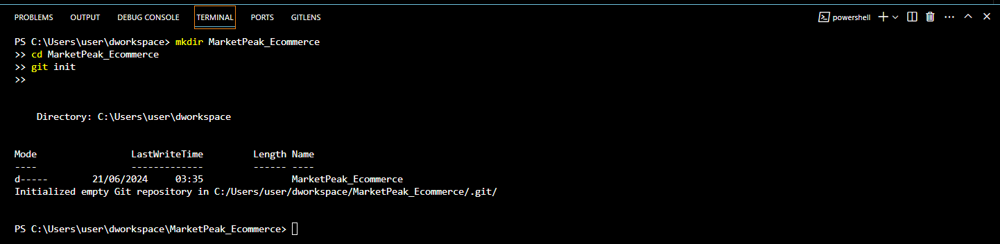

## Obtain and Prepare the E-commerce Website Template

Instead of developing the website from scratch, you will use a pre-existing website template, which will allow you focus on the deployment and operational aspects, rather than the web development.  

+ Download a Website Template, visit [Tooplate](tooplate.com) or any other free template resource, and download a suitable e-commerce website template. Get a template that is ready to use and require minimal adjustments.

+ Extract the downloaded template and ensure you save it in your project directory (i.e MarketPeak_Ecommerce)

## Stage and Commit the Template to Git

Add the website files to Git repository and set your Git global configuration with your username and email. Commit your changes with a clear, descriptive message. In the command below, the dot "." signifies present directory. Instead of using "git add filename", you can use "git add ." which is preferable because it's more than one file

```
git add .
git config --global user.name "YourUsername"
git config --global user.email "Youremail@example.com"
git commit -m "initial commit with basic e-commerce website structure"
```
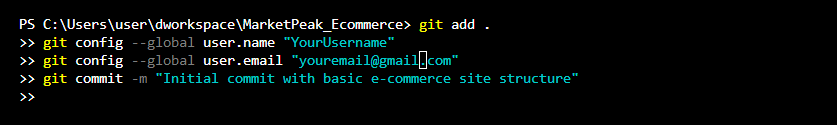

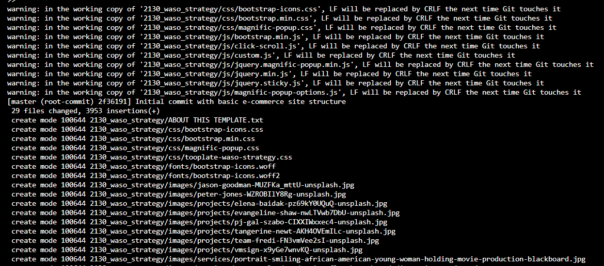

## Push the code to your Github repository

After intializing and adding your e-commerce website template, it is neccessary to push your code to a remote repository on GitHub. This step is crucial for version control and collaboration.

- Create a remote repository on Github by login into your Github account and creating a new repository named "MarketPeak_Ecommerce". Leave the repository empty without initializing it with a README, .gitignore, or license.
- Link your local repository to Github by opening your terminal(VScode, windows Powershell, Mobaxterm etc), navigate to your project directory, add the remote repository URL to your local repository configuration.

```
git remote add origin http://github.com/your-git-username/MarketPeak_Ecommerce.git
```
> [!Note]
> Ensure you replace "your-git-username" in the above command. with your actual git username.


Push your code to upload your local repository content to your GitHub repository but first, you have to create the "main" branch and push from it 

```
git branch -M main
git push -u origin main
```
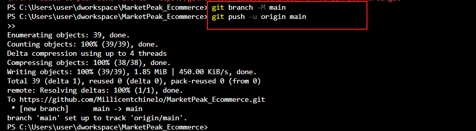

## AWS Deployment

To deploy "MarketPeak_Ecommerce" platform, you'll start by setting up an Amazon EC2 instance:
- Log in to the AWS Management Console: search for EC2 on the search bar. Click on launch instance as shown on the image below.

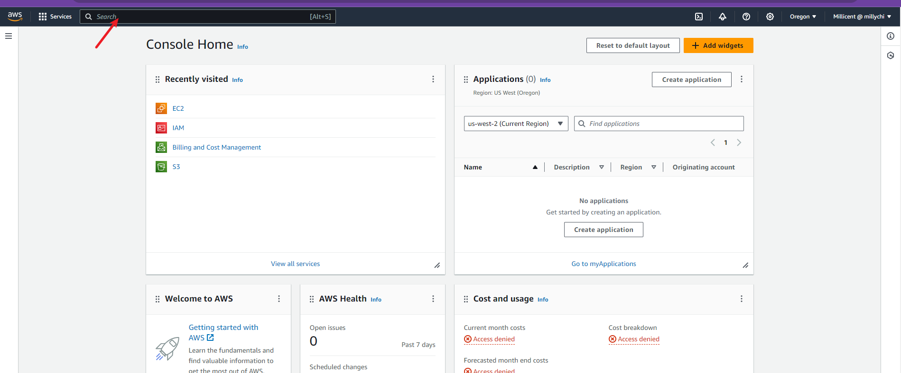

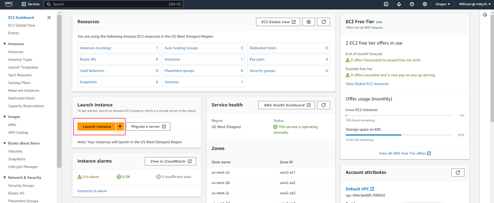

- Launch an EC2 instance using an Amazon Linux AMI: on the name tag, you can name the EC2 "MarketPeak_Ecommerce". Choose Amazon Linux as your AMI. For instance type, you should pick t2 micro which is free tier. Next, you create a key pair. It is important to note the name you gave your key pair and note where it is downloaded into. The key will be need when you want to SSH into your instance from your terminal. Then, create a security group, ensure you choose the allow SSH and Allow HTTP as shown in the image below. By your right, check the summary of the choices you made(cross-check that you made the right choice), then click on launch instance.

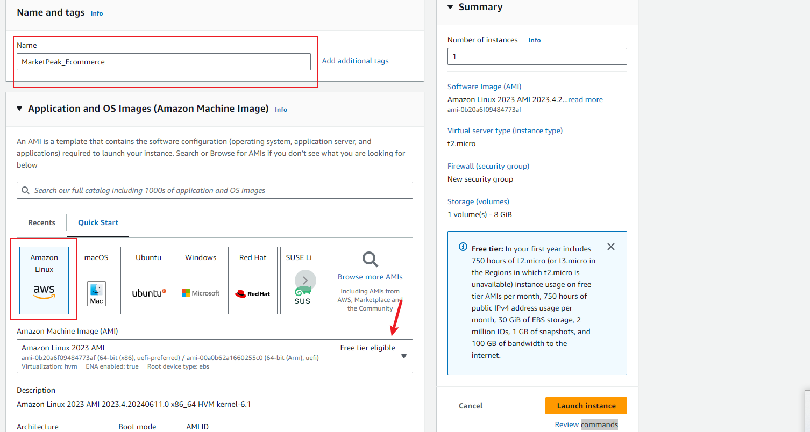

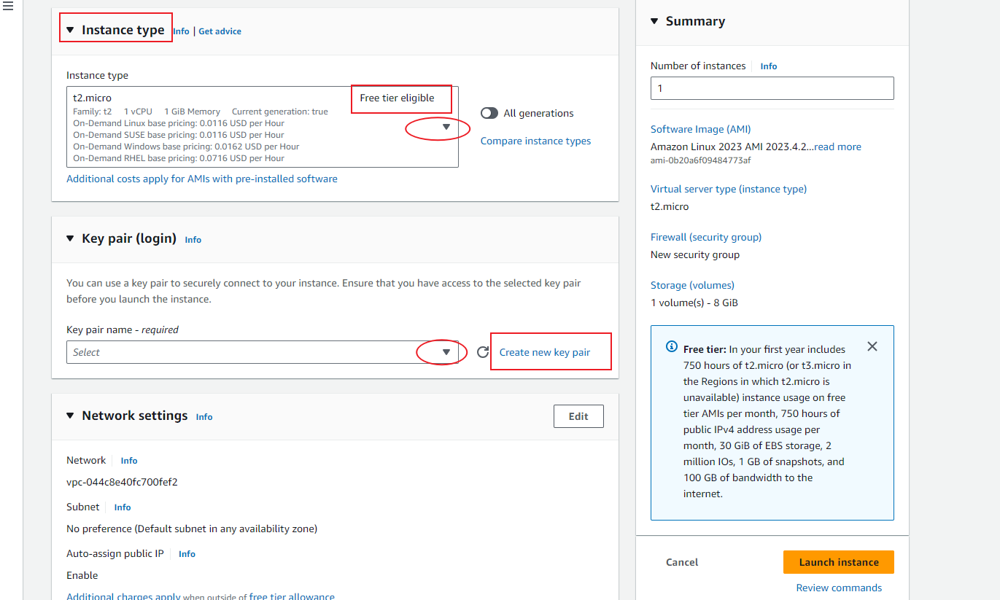

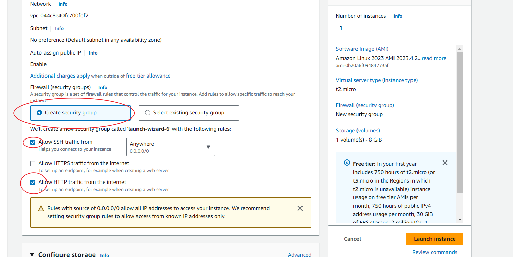

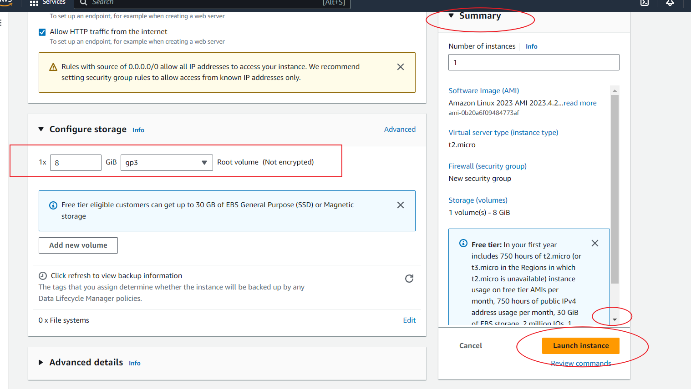

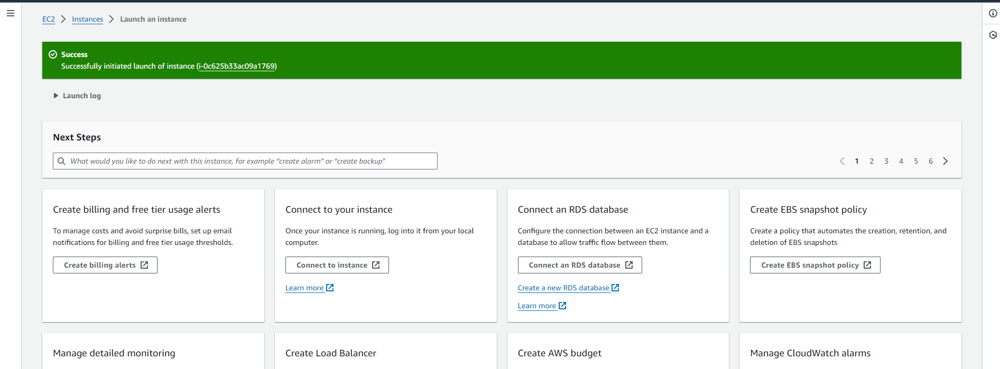

- Connect to the instance using SSH: To connect the instance created, Navigate back to the instances page, select that particular EC2 instance named MarketPeak_Ecommerce. On the upper right, click on connect. Choose SSH client, and click on example to copy the code as shown in the image below. 
Go to your terminal. Navigate to where you saved your secret key(it is usually in download directory). Ls, to veiw and be sure your secret key is in your present directly. Once you see your secret key in your directory, then paste the ssh code you copied earlier.

> [!Note]
> You won't be able to SSH into your instance, if the secret key is not in present directory

```
ls
```

```
ssh -i "yourkey" ec2-user@Yourpublic-ip.Yourec2-Region.compute.amazonaws.com
```

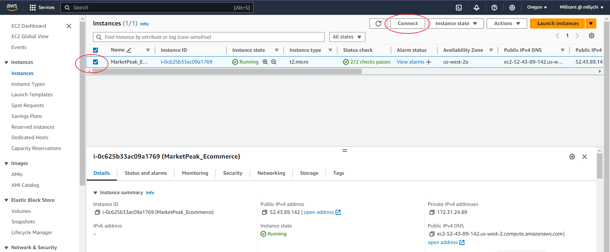

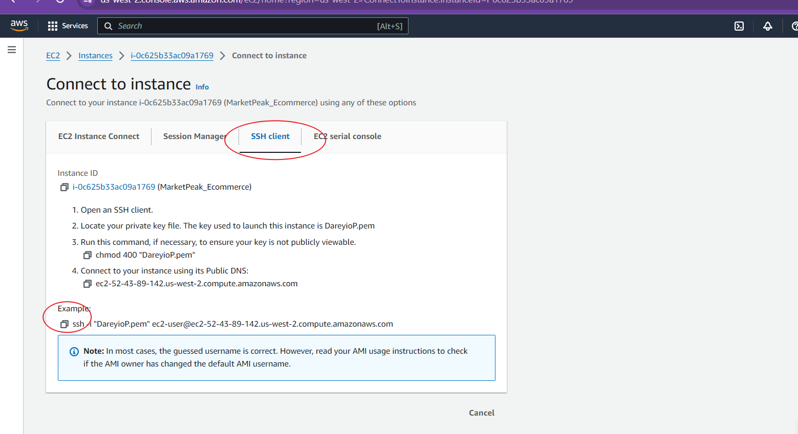

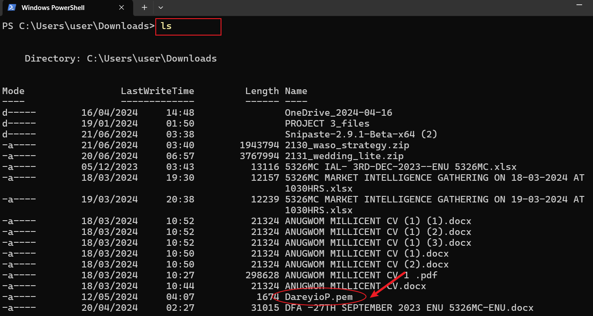

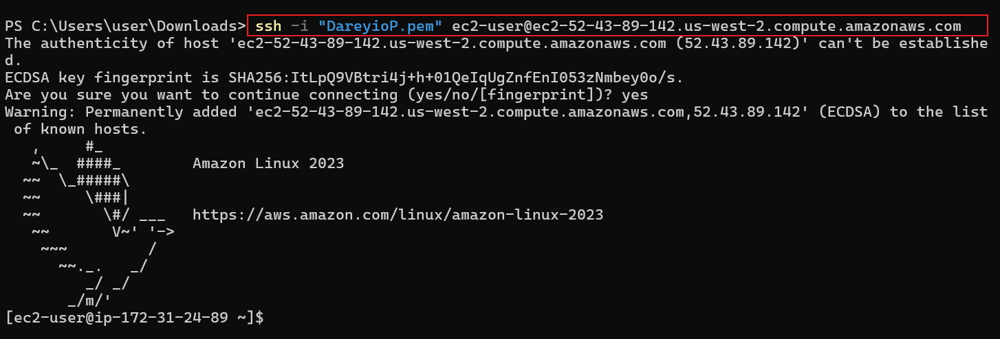

## Clone the repository on the Linux Server

Before deploying your e-commerce platform, you need to clone the GitHub repository to your AWS EC2 instance. This process involves authenticating with GitHub and choosing between two primary methods of cloning a repository: 
1. SSH and 
2. HTTPS. 
To see the ssh or http link to clone your repository
- Navigate to your repository in github console
- Select the code as highlighted in the image below.

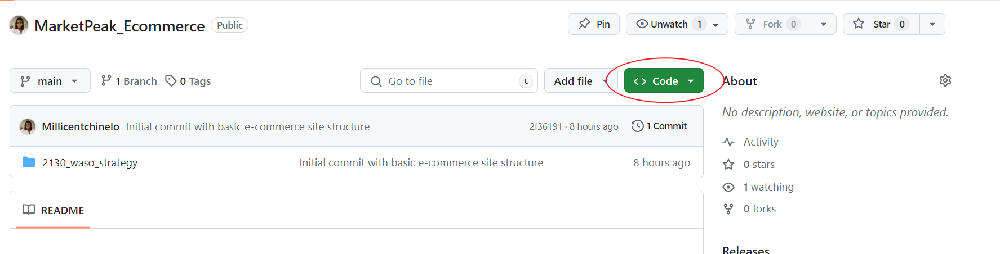

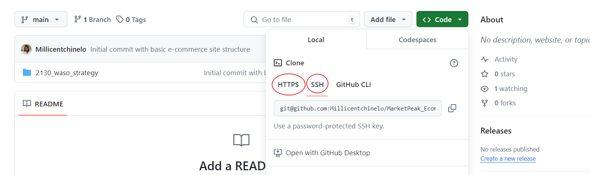

1. ### **SSH Method:**

-	On your EC2 instance that you have SSHed into, generate SSH keypair using ssh-keygen.

```
ssh-keygen
```

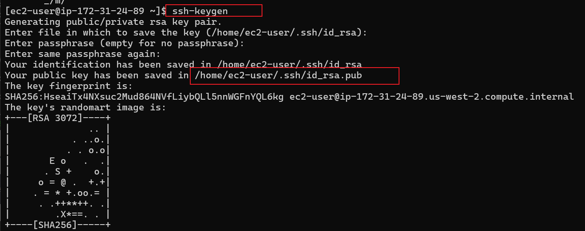

-	Display and Copy your public key

```
cat /home/ubuntu/.ssh/id_rsa.pub
```

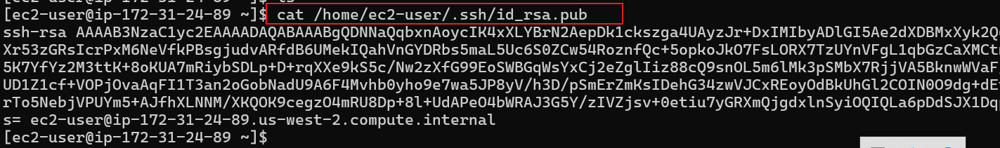

>[!Note]
> Your ssh public key will different

-	Add the SSH public key to your GitHub account: Navigate to the right of your GitHub account. click on your profile picture to expose other options. Then click on settings as shown in the image below.  Next, choose SSH and GPG keys. By the right of the SSH key, click "New SSH key". Paste the public key copied earlier and save it.

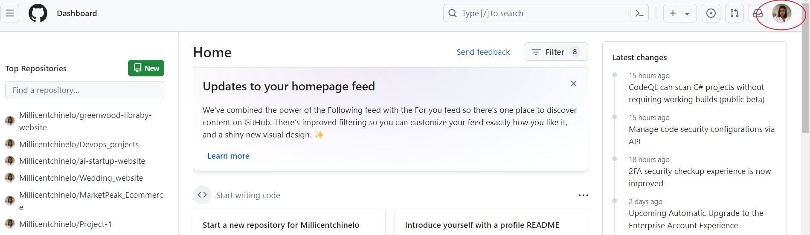

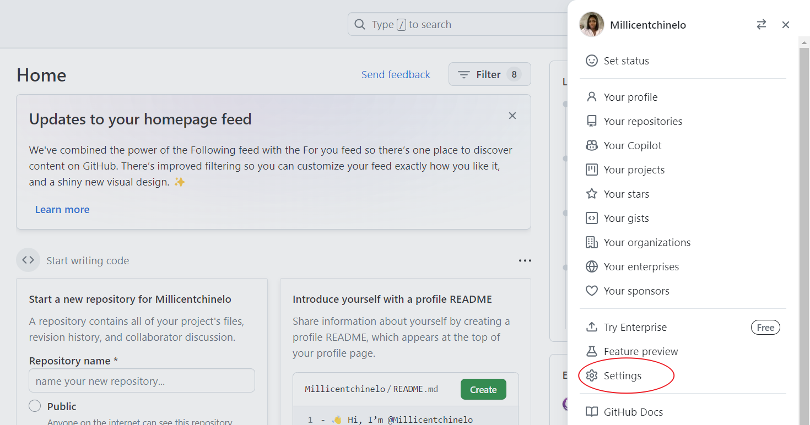

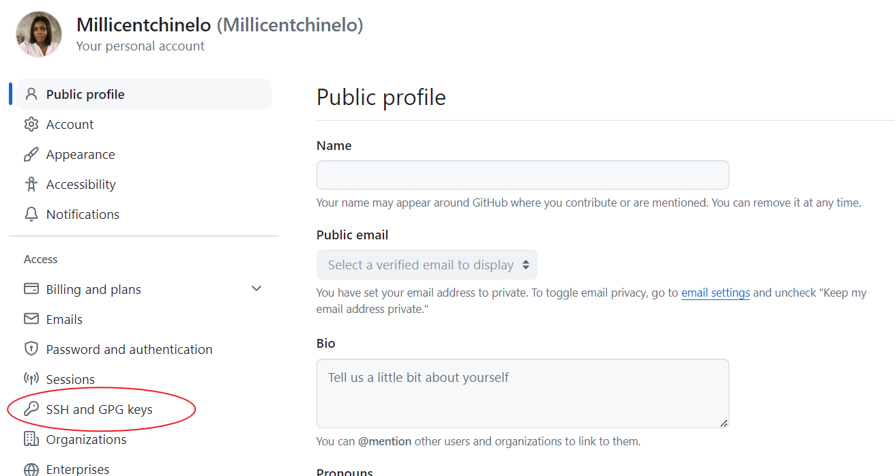

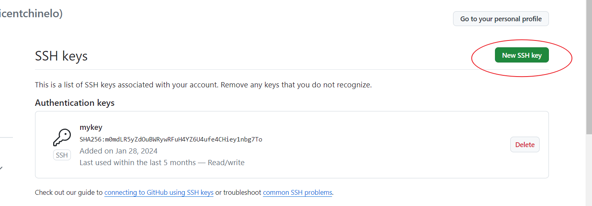


-	Use the SSH clone URL to clone the repository:

```
git clone git@github.com:your username/MarketPeak_Ecommerce.git
```


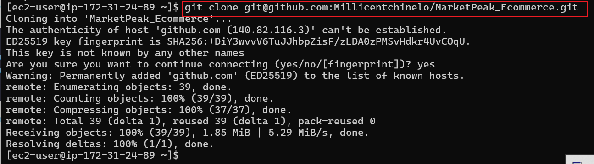

2. ### **HTTPS Method:**
For repositories that you plan to clone without setting up SSH keys, use the HTTPS URL. GitHub will prompt for your username and password:

```
git clone https://github.com/yourusername/MarketPeak_Ecommerce.git
```
> [!Note]
> Now when you check the content of your present directory using ls-command, you will see your MarketPeak_Ecommerce directory

```
ls
```

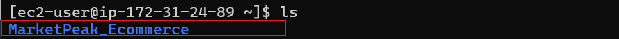

## Install a Web Server on EC2

Apache HTTP Server (httpd): is a widely used web server that serves HTML files and content over the internet. Installing it on Linux EC2 server allows you to host MarketPeak E-commerce site:

•	Install Apache web server on the EC2 instance. Note that httpd is the software name for Apache on systems using yum package manager

```
sudo yum update -y
sudo yum install httpd -y
sudo systemctl start httpd
sudo systemctl enable httpd
```

This first updates the linux server and then installs httpd (Apache), starts the web server, and ensures it automatically starts on server boot.

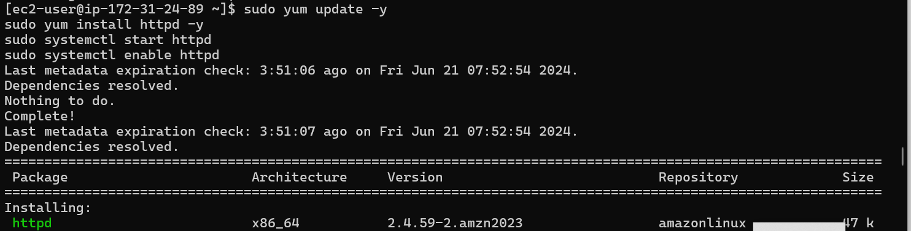

## Configure httpd for Website

To serve the website from the EC2 instance, configure httpd to point to the directory on the Linux server where the website code files are stored. Usually in /var/www/html.

-	Prepare the Web Directory: Clear the default httpd web directory and copy MarketPeak Ecommerce website files to it.

```
sudo rm -rf /var/www/html/*
sudo cp -r ~/MarketPeak_Ecommerce/* /var/www/html/
```

The directory /var/www/html/ is a standard directory structure on Linux systems that host web content, particularly for the Apache HTTP Server.
When you install Apache on a Linux system, the installation process automatically creates this directory. It's designated as the default document root in Apache's configuration, meaning that Apache is set up to serve web files (such as HTML, CSS, and JavaScript files) located in this directory to visitors of your website.
-	Reload httpd: Apply the changes by reloading the httpd service.
```
sudo systemctl reload httpd
```

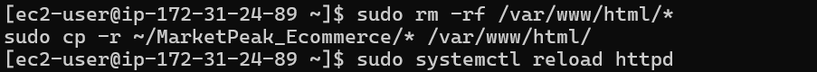

## Access Website from Browser

- With httpd configured and website files in place, MarketPeak Ecommerce platform is now live on the internet:
- Copy and paste the public IP of your EC2 instance on any web browser of your choice, to view the deployed website.

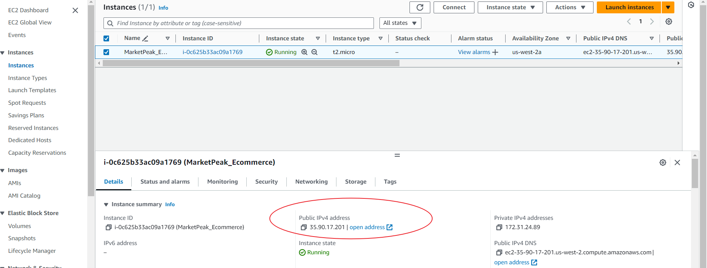


## Continuous Integration and Deployment Workflow

To ensure a smooth workflow for developing, testing, and deploying your e-commerce platform, follow this structured approach. It covers making changes in a development environment, utilizing version control with Git, and deploying updates to your production server on AWS.

Step 1: Developing New Features and Fixes
-	Create a Development Branch: Begin your development work by creating a separate branch. This isolates new features and bug fixes from the stable version of your website. 

```
git branch development
git checkout development
```

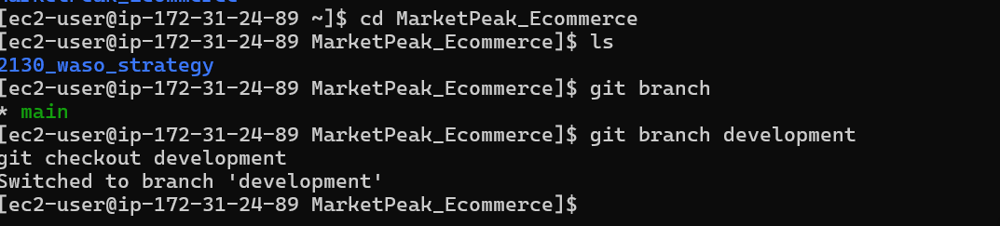

-	Implement Changes: On the development branch, add your new features or bug fixes by editing the index.html file. This might include updating web pages, adding new products, or fixing known issues. 

Step 2: Version Control with Git
-	Stage Your Changes: After making your changes, add them to the staging area in Git. This prepares the changes for a commit.

```
git add .
```

- Commit Your Changes: Securely save your changes in the Git repository with a commit. Include a descriptive message about the updates.

```
git commit -m "Add new features or fix bugs"
```
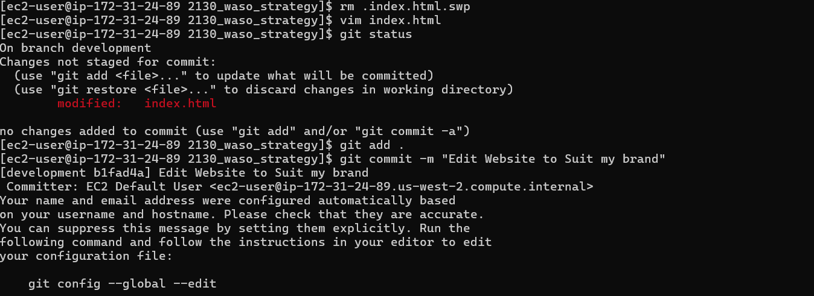

- Push Changes to GitHub: Upload your development branch with the new changes to GitHub. This enables collaboration and version tracking.

```
git push origin development
```
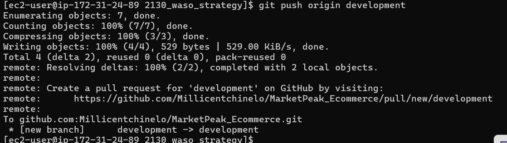


Step 3: Pull Requests and Merging to the Main branch

-	Create a Pull Request (PR): On GitHub, create a pull request to merge the development branch into the main branch. This process is crucial for code review and maintaining code quality.

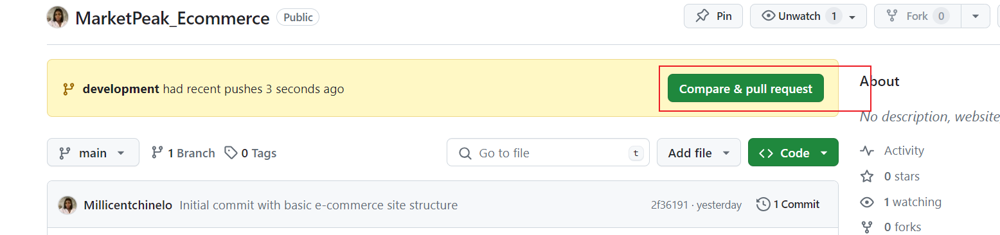

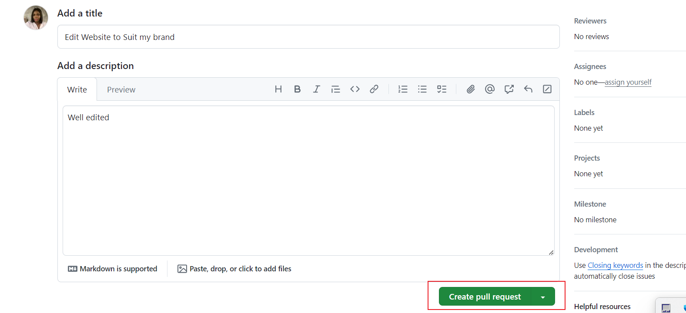

- Review and Merge the PR: Review the changes for any potential issues. Once satisfied, merge the pull request into the main branch, incorporating the new features or fixes into the production codebase.

```
git checkout main
git merge development
```

-	Push the Merged Changes to GitHub: Ensure that your local main branch, now containing the updates, is pushed to the remote repository on GitHub.

```
git push origin main
```

Step 4: Deploying Updates to the Production Server
-	Pull the Latest Changes on the Server: SSH into your AWS EC2 instance where the production website is hosted. Navigate to the website's directory and pull the latest changes from the main branch.

```
git pull origin main
```

-	Restart the Web Server (if necessary): Depending on the nature of the updates, you may need to restart the web server to apply the changes.

```
sudo systemctl reload httpd
```
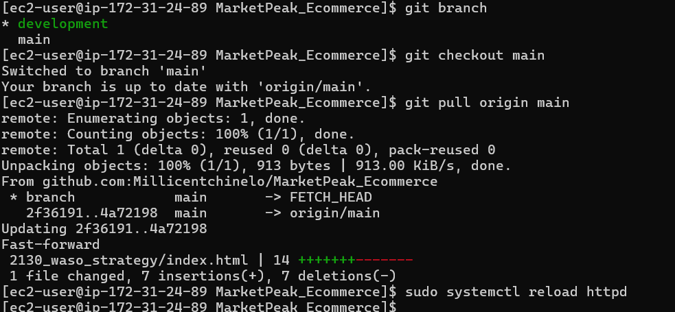

Step 5: Testing the New Changes
-	Access the Website: Open a web browser and navigate to the public IP address of your EC2 instance. Test the new features or fixes to ensure they work as expected in the live environment, but first you have to re-edit the /var/www/html by recopying your MarketPeak_Ecommerce directory to your /var/www/html. Hence it will now have the editted version of your MarketPeak_Ecommerce directory. Access the website from your browser and Checkout the effected changes.

```
sudo rm -rf /var/www/html/*
sudo cp -r ~/MarketPeak_Ecommerce/* /var/www/html/
```
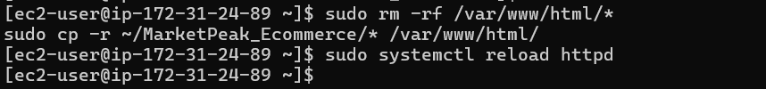


**This workflow emphasizes best practices in software development and deployment, including branch management, code review through pull requests, and continuous integration/deployment strategies. By following the above steps, you maintain a stable and up-to-date production environment for your e-commerce platform.**

## **TROUBLESHOOTING**

These are some of the challenges face while working on the project and how I resolved them. You may or maynot encounter them, but take note of them as it might help in future project.

1. Git push-error: After creating the MarketPeat_Ecommerce directory and initiazing Git on it. When I tried to push the website template that was staged and committed in it, to GitHub remote repository,using the "git push origin main" command, it popped up an error stating that there is no branch named main.

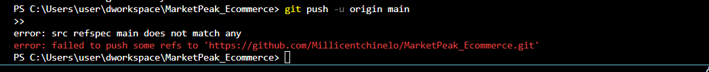

+ **Solution:** I created a branch called main and then i was able to push the committed website template to remote GitHub repository

```
git branch -M main
```


2. Git Not Installed: Trying to clone my GitHub repository into my instance, it showed "git command not found".

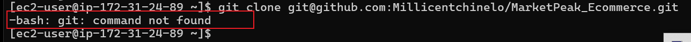

+ **Solution:** I installed git and then, i was able to clone my GitHub repository

```
sudo yum install git
```

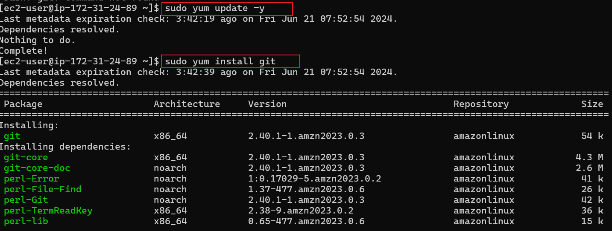


3. Git Authentication Error: Using the Http method to clone my GitHub repository into my EC2 instance, it required authentication, and when I used my username and account password, stating that normal account password is not allowed for authentication while working on your terminal.


+ **solution:**  I navigate to my GitHub account and created a Personal Access Token which I used for my authentication. Steps to take to get your Personal Acesss Token include:

+ * *Navigate to Settings: In the top-right corner of any GitHub page, click your profile picture, then click "Settings".*

+ * *Go to Developer Settings: In the left-hand sidebar, select "Developer settings".*

+ * *Click on Personal Access Tokens: Under the "Personal access tokens" section, click "Tokens (classic)".*

+ * *Create a new token: Click the "Generate new token" button.
Provide a name and expiration time for the token. Give the token a name that will help you identify its purpose. Choose an expiration date for the token based on your needs. GitHub suggests a maximum expiration of one year for security reasons.*

+ * *Set the scopes and permissions: You can specify the access level you want the token to have. For example, you can grant it full access to all repositories, or limit it to specific repositories and actions.*

+ * *Generate token: Once you've set the name, expiration, and scopes, click the "Generate token" button.
Save your token after generating the token, GitHub will display it on the screen.* 

>[!IMPORTANT]
>*Make sure to copy the token and save it somewhere secure. You won't be able to see the token again once you leave the page. You can now use the Personal Access Token in place of a password when authenticating with GitHub's API, GitHub CLI or when using your terminal.*

4. Vim Error: while I was editting the index.html file, my network was unstable, hence I lost connection to EC2 instance Server. When i SSHed again into my EC2" instance and tried to continue editting my index.html, it kept popping up error that my another index.html.swp file has been created.

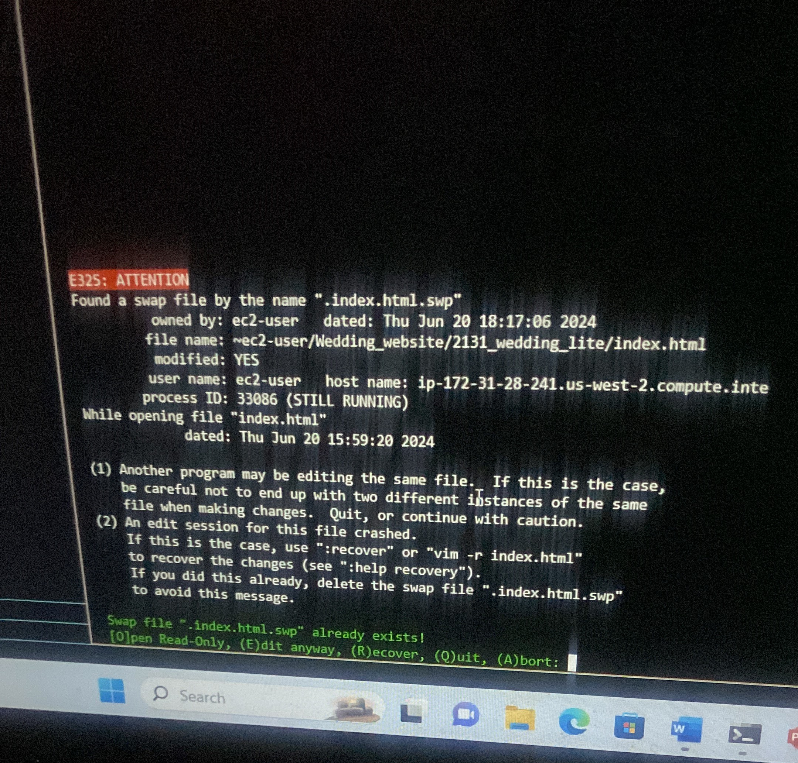
+ **Solution:** I recovered my index.html file and deleted the extra index.html.swp file. Then continued editting my index.html file. The command I used was:

```
vim -r index.html
```

```
rm .index.html.swp
```


5.Webpage not reflecting the content of the index.html file: when accessing the deployed website on a web browser, it wasn't showin the actual content, rather, it showed "It Works"

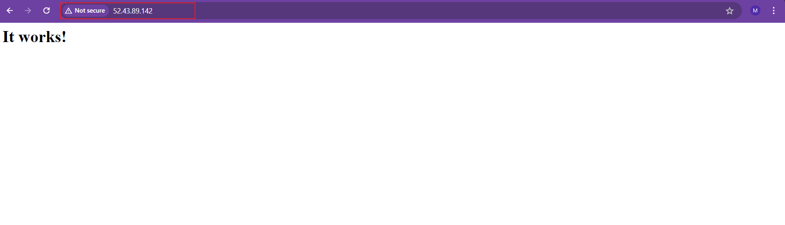

+ **Solution:** I initially only pasted the public ip address of the website but the website needed to point to something (or a port), which in this project case, it was the name of the template. To check what the website is pointing to, use the command:

```
ls -l /var/www/html
```
Then I pasted the public ip of the instance/the template name and the issue was resolved.

```
http://public_ip/2130_waso_strategy
```
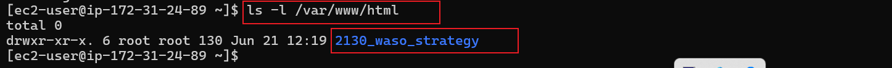


6. Webpage Not reflecting Edited Content: After editing my index.html file with new title and content. I reloaded my website but it was still showing the old content.

+ **Solution:** Apache(Httpd) is a web server that serves HTML files and content over the internet. By default, it come with a /var/www/html directory where it stores the content it serves over the internet. Hence whatever is in the var/www/html directory is what it will show over the internet. Meaning for any change to reflect, you first delete what is in the /var/www/html directory and then,copy what is in the directory that has the "index.html file" into the "/var/www/html" using the command below:

```
sudo rm -rf /var/www/html/*
sudo cp -r ~/MarketPeak_Ecommerce/* /var/www/html/
```
Reload the Httpd server using the command:

```
sudo systemctl reload httpd
```
After  this reloading the web browser will give you the updated version.


