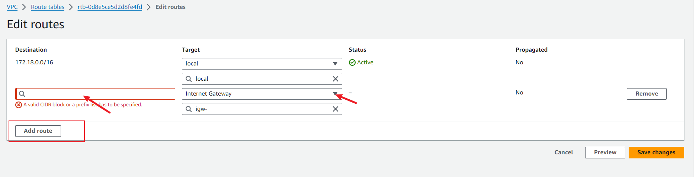
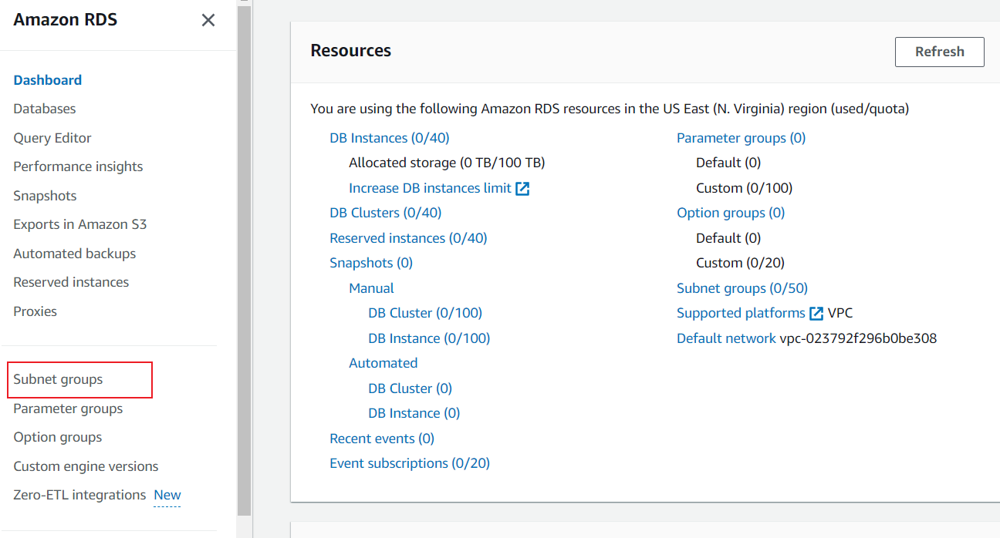
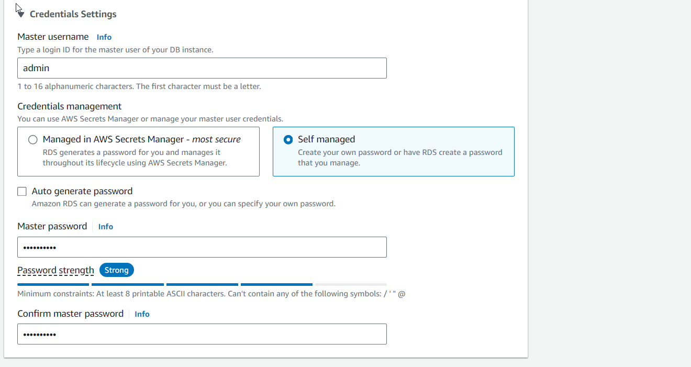
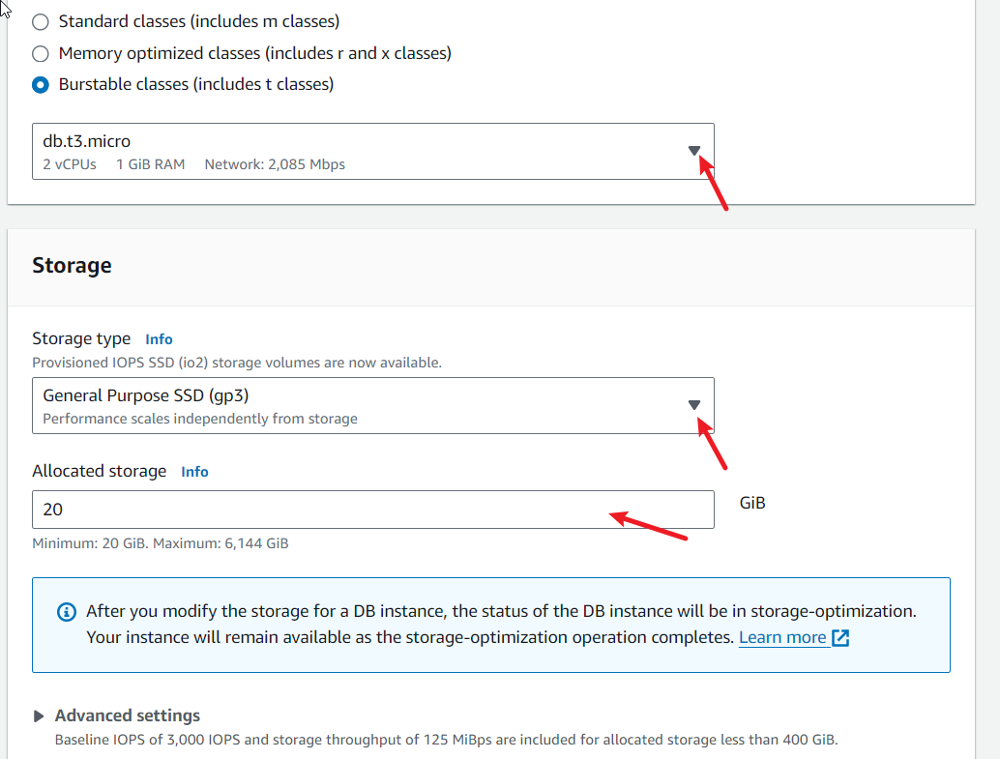
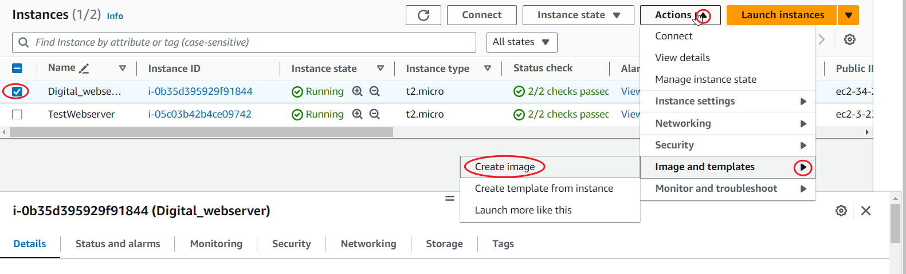
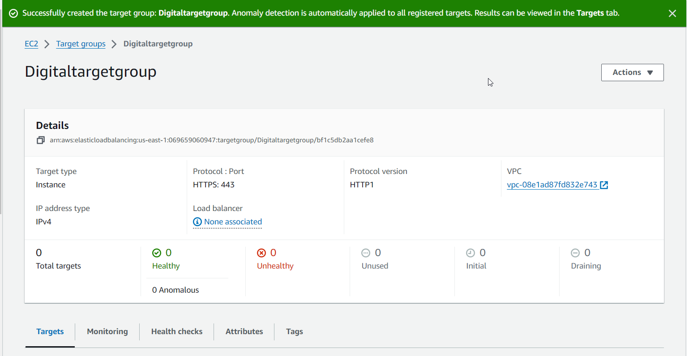
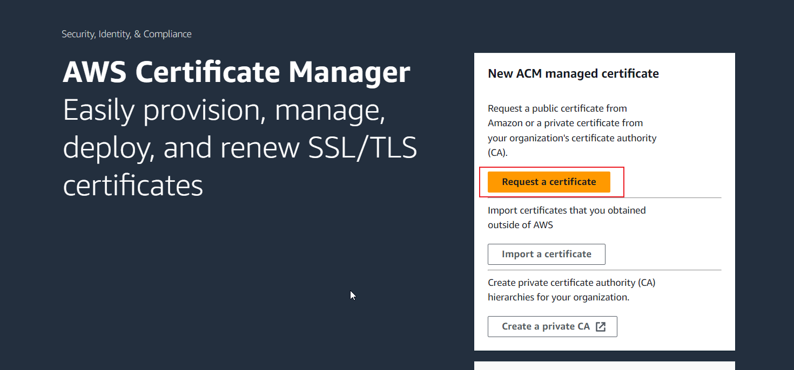
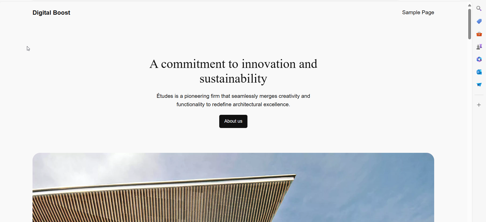
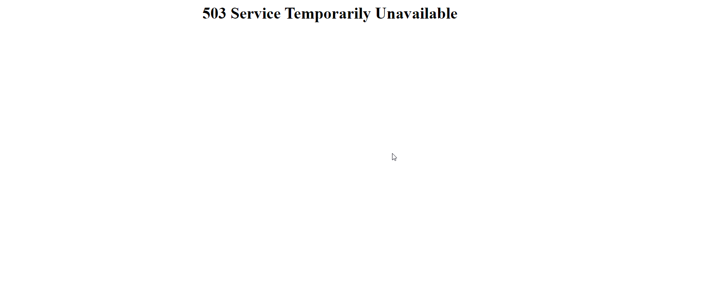

# WORDPRESS SITE ON AWS
## Project Scenario
A small to medium-sized digital marketing agency, "**DigitalBoost**", wants to enhance its online presence by creating a high-performance **WordPress-based website** for their clients. The agency needs a scalable, secure, and cost-effective solution that can handle increasing traffic and seamlessly integrate with their existing infrastructure. Your task as an AWS Solutions Architect is to design and implement a WordPress solution using various AWS services, such as Networking, Compute, Object Storage, and Databases


## Create VPC 
- In your AWS console, on the search bar, input 'vpc'.
- Ensure you are in your preferred region
- In the VPC dashboard, click on create vpc only.
- Leave it at "IPV4 CIDR manual block.
- Choose CIDR block e.g 172.18.0.0/16
- Ensure you enable DNS hostname
- Ignore the rest, scroll down and click create VPC


## Create internet gateway and attach it to the VPC

- In the VPC dashboard, by your left, navigate to Internet gateway and click on it.
- Give your internet gateway a name(preferable a name in-line with the project)  and click on create internet gateway.
- Attach your internet gateway to your VPC


## Create two Public subnets in two avalailabity zones and modify it to enable auto-assign public IP
- On the VPC dashboard, navigate to the left and click on subnet.
- By your right, click on create subnet
- For public subnet, choose a small CIDR range e.g 172.18.1.0/24, 172.18.0.0/24, 172.18.2.0/24 etc 
- Reserve the last octate for the computer
- Enable auto-assign IPV4 address for the public subnets 


## Create a public Route Table; Edit the route to enable internet-gateway and associate the public-subnet
- Write the name of the route table.
- Choose the VPC created earlier as the VPC it should be attached to.
- Click on edit route by the left
- Click on add Route


- Add CIDR block and choose target to be internet gateway, then choose the particular gateway in "routing to". 
- Choose 0.0.0.0/0, Under the internet gateway option, select that particular gateway I.D. By default, all resources in the same VPC can communicate with each other, but when they need to communicate with outside resource then, they need the internet gateway if you notice, there is default rule already in the route table that allows for all resources in that VPC to communicate locall with each other.
- Attach the internet gateway to your VPC.




## Create four private subnets. Two for the app and two for database

- For the private subnet, you can use a wide range for the CIDR block e.g 172.18.0.0/20, 172.18.16.0/20, 172.18.48.0/20 etc.


## Create a route table for the private subnets
- Create another route table for the private subnet.
- Write the name as privateRT and click on the dropdown and choose your VPC created earlier, then  click on create route table.

 


## Allocate Elastic IP address for the NATgateway 

- Navigate to the EC2 Dashboard:
In the Services menu, select EC2.
In the left navigation pane, find and click on Elastic IPs under the Network & Security section.

- Click on the Allocate Elastic IP address button.
If prompted, select the scope (VPC or EC2-Classic if applicable) and click Allocate.


#### Create  NAT gateway in the public subnet, then add it to the private route table to enable it access internet
Nat gateway is pay per hour.
- Navigate to nat gateway dashboard and click on create Nat gateway.
- Give it a name, Choose a **public subnet** for it.
- Choose connectivity type as public.
- Choose the Elastic ip earlier created, thec scrool down and click create.
- Go back and edit private route table, Choose i.p address 0.0.0.0/0 and choose the Nat gateway as where the traffic will be routed to. 


> [!IMPORTANT]
> Always create an instance in the private subnet after connecting it to the Nat gateway. This is to **test** that the private subnet is getting internet through the Nat gateway, before creating the ASG in private subnet. Bastion host can be used to SSH into the instance in private subnet and run the test.

 #### Create security group for the Loadbalancer; Web-server(ASG); Database and Elastic file system (EFS), Bashion Host, with the right rules


- From the image above, you will see the right permission for each resource.
-We are going to allow access to our app through load balancer, hence, we have to give permission for http and https to access our resources; click on the drop down and choose http, source(choose anywhere IPV4)
- When choosing port for any other resource, choose custom TCP, if you are not sure of the type, then choose the right port range.

Security groups act as virtual firewalls for EC2 instances, controlling inbound and outbound traffic.

1. **Application Load Balancer Security Group (ALB Security Group)**:
   - Create and configure inbound rules to allow HTTP (Port 80) and HTTPS (Port 443) from `0.0.0.0/0`.

2. **SSH Security Group**: **This is the SG of the Bastion Host**
   - Allow SSH (Port 22) from your IP address.


3. **Webserver Security Group**: This will be the SG for all the instances that will be created for this project
   - Allow SSH (Port 22) from the "Bastion Security Group".
   - Allow HTTP (Port 80) and HTTPS (Port 443) from the "ALB Security Group".

4. **Database Security Group**:
   - Allow MYSQL/Aurora (Port 3306) from the "Webserver Security Group".

5. **EFS Security Group**:
   - Allow NFS (Port 2049) from the "Webserver Security Group".
   - Allow SSH (Port 22) from the "SSH Security Group".


#### Create database subnet group

- In the database dashboard, by the left, first create a database subnet group before creating a database. 
- Add the name of the subnet group, choose a VPC identifier that corresponds to the subnets you want to use for your database subnet group.
- Choose the AZ, for this project, we have 3AZ
- Add description, choose subnets in the private subnets.
- Scroll down and click create, to create the subnet. 




#### Create and configure Database
- To be created in private subnet
- Click standard create
-Choose MySQL Engine, Choose versions that support the multi-AZ DB cluster.
- Choose the Engine version
- Choose Dev/test, for igh availability
- Choose multi-AZ DB instance


- Under DB instance identifier, write a **Name**, you want to use for your database instance, which is the instance in your database.
- Create your credentials: Add yourself as admin and write your password.
- Choose if your password will be managed by AWS Secret manager or self-managed. You can autogenerate your password or write it yourself.
- Under DB instance class, choose Burstable classes(its cheaper).





- Storage type; choose general purpose SSD(gp2)
- Under additional information, input your **Database name**. It is very important to name the database because it will be used for connection to the webserver.


- Enable storage autoscaling, but your maximum storage threshold, which the highest is 6,144 but you can leave at 1000(default value) or 20GiB which  is ok for this project.
-Connectivity: Since we have not crated our ASG group yet, we will choose "don't connect to an EC2 compute resource" and click on ipv4
- Choose your VPC for this project
- Choose your subnet group, the one we created earlier. For public access, click no, because we don't want everyone to easy access our database directly.
- Choose the security group created earlier for this database.
- For database authentication, choose password authentication.


#### Create Elastic File System

- in EFS dashboard, click create file system. enter the name and the VPC, then click customize. File system type; choose regional 
- Enable automatic backups, under lifecycle management, You can choose a different lifecycle, but for this project, I chose "30 days since last access", then it can be transitioned into infrequentnaccess(IA).
- Enable encryption of data at rest for security enhancement.


- Throughput mode: Choose Enhanced, it provides more flexibility and higher throughput levels.
- Click "Elastic" as it is pay as you use 
- Performance mode: click "general purpose".
- Choose availability zones and its corresponding subnet in **private subnet**. Also use the security group for EFS created earlier.
- Writing the file system policy is optional, so you click next to navigate to the summary page where you cross-check all the options you choose. click create to initiate the creation of the EFS.


- **To see the manual code to mount your Efs on EC2**: Select the particular EFS and click view details and select "attach". You can choose to mount via DNS or via IP. For this project, select via DNS.


#### Create an EC2 instance 
- Use **linux** AMI to create this EC2 


#### SSH into the EC2 instance and change to root
- On your EC2 dashboard, select the EC2 you want to SSH into, and select the connect option on the topmost right. 
- select the SSH option and you will see the SSH command to use and connect to your EC2 instance. Copy and paste the command on your terminal. 

```
ssh -i wp-app-key.pem ec2-user@<WordPressPrivateIP>
```

- Use the command below to change to root user

```
sudo su
```


## Install WordPress on the WordPress Server

**Use the following commands to install WordPress on the WordPress Server(EC2 instance):**

#### Run "yum update -y" to update the webserver


```
yum update -y
```


#### create the html directory to mount the EFS file "mkdir -p /var/www/html"
```
mkdir -p /var/www/html
```

#### Mount the EFS file into the newly created directory "sudo mount -t nfs4 -o nfsvers=4.1,rsize=1048576,wsize=1048576,hard,timeo=600,retrans=2,noresvport fs-0a03cac5dddf1f3e5.efs.us-east-1.amazonaws.com:/ /var/www/html"

**To see the manual code to mount your Efs on EC2**: Select the particular EFS and click view details and select "attach". You can choose to mount via DNS or via IP. For this project, select via DNS.

```
sudo mount -t nfs4 -o nfsvers=4.1,rsize=1048576,wsize=1048576,hard,timeo=600,retrans=2,noresvport fs-03c9b3354880b36a6.efs.us-east-1.amazonaws.com:/ /var/www/html

```
>Note: Edit the above EFS I.D and region to reflect your own EFS I.D and region respectively, before running the command. 

#### Install Apache(httpd) and its dependencies "sudo yum install -y httpd httpd-tools mod_ssl"
```
sudo yum install -y httpd httpd-tools mod_ssl
```


#### Enable and start the httpd by running the command "systemctl enable httpd" "systemctl start httpd"

```
sudo systemctl enable httpd 
sudo systemctl start httpd
```


#### Install php by running "sudo yum install php" 

```
sudo yum install -y php
```


 #### Clean metadata by running the command "sudo yum clean metadata"
 
```
sudo yum clean metadata
```


#### Run the command "sudo yum install php php-common php-pear -y"

```
sudo yum install php php-common php-pear -y
```


#### Run the command "sudo yum install php-{cgi,curl,mbstring,gd,mysqlnd,gettext,json,xml,fpm,intl,zip} -y" to install other php dependencies 

```
sudo yum install php-{cgi,curl,mbstring,gd,mysqlnd,gettext,json,xml,fpm,intl,zip} -y

```


### **Install mysql5.7**


#### Run the command "sudo rpm -Uvh https://dev.mysql.com/get/mysql57-community-release-el7-11.noarch.rpm"

```
sudo rpm -Uvh https://dev.mysql.com/get/mysql57-community-release-el7-11.noarch.rpm
```

#### Run the command "sudo rpm --import https://repo.mysql.com/RPM-GPG-KEY-mysql-2022"

```
sudo rpm --import https://repo.mysql.com/RPM-GPG-KEY-mysql-2022
```

#### Run the command "sudo yum install mysql-community-server -y"

```
sudo yum install mysql-community-server -y
```

#### Run the command "sudo systemctl enable mysqld" and "sudo systemctl start mysqld"

```
sudo systemctl enable mysqld
sudo systemctl start mysqld
```


####  **Set permissions**
Run the below command to set permissions. **Ensure you are in root user before executing the below commands** Use the below command to change to root user.

```
sudo su
```


```
sudo usermod -a -G apache ec2-user
sudo chown -R ec2-user:apache /var/www
sudo chmod 2775 /var/www && find /var/www -type d -exec sudo chmod 2775 {} \;
sudo find /var/www -type f -exec sudo chmod 0664 {} \;
chown apache:apache -R /var/www/html
```


####  Download wordpress files

```
wget https://wordpress.org/latest.tar.gz
tar -xzf latest.tar.gz
cp -r wordpress/* /var/www/html/
```


### Create the wp-config.php file 

```
cp /var/www/html/wp-config-sample.php /var/www/html/wp-config.php
```

### Edit the wp-config.php file
You can use Nano or Vim editor

```
nano /var/www/html/wp-config.php
```


#### Restart the webserver

```
service httpd restart
```


#### Copy the EC2 instance public IP address and paste it on the web-browser 


#### Register and install the wordpress 


 

### Spin up two instances in the private subnets (It will be used for the load balancer setup) using a user-data or AMI. Here are both methods:

#### Method 1: Using user data
```
#!/bin/bash
yum update -y
sudo yum install -y httpd httpd-tools mod_ssl
sudo systemctl enable httpd 
sudo systemctl start httpd
sudo amazon-linux-extras enable php7.4
sudo yum clean metadata
sudo yum install php php-common php-pear -y
sudo yum install php-{cgi,curl,mbstring,gd,mysqlnd,gettext,json,xml,fpm,intl,zip,mysqli} -y
sudo rpm -Uvh https://dev.mysql.com/get/mysql57-community-release-el7-11.noarch.rpm
sudo rpm --import https://repo.mysql.com/RPM-GPG-KEY-mysql-2022
sudo yum install mysql-community-server -y
sudo systemctl enable mysqld
sudo systemctl start mysqld
echo "fs-0a03cac5dddf1f3e5.efs.us-east-1.amazonaws.com:/ /var/www/html nfs4 nfsvers=4.1,rsize=1048576,wsize=1048576,hard,timeo=600,retrans=2 0 0" >> /etc/fstab
mount -a
chown apache:apache -R /var/www/html
sudo service httpd restart"
```

> NOTE:
> Edit the mount credentials in the above user data to reflect your EFS details created for this project

#### Method 2: Using AMI

Creating an Amazon Machine Image (AMI) from an EC2 instance can be done through the AWS Management Console:  

Method 1: Using the AWS Management Console

- Go to the AWS Management Console and log in.
Navigate to EC2:
- In the Services menu, select EC2.
- Select Your Instance:
Find the instance you want to create an AMI from in the Instances section and select it. **Ensure the instance is in stop state** before creating AMI from it, inorder for the new AMI to maintain its integrity after creation.  
- Create Image:
Click on the Actions button.
Navigate to Image and templates > Create image.
- Configure Image Settings:
Image name: Give your AMI a name.
Description: (Optional) Add a description.
No Reboot: Decide if you want to reboot the instance. By default, this option is unchecked, allowing for a consistent image.
- Create the AMI:
Click on Create image.
- Monitor AMI Creation:
Go to the AMIs section in the EC2 dashboard to monitor the status of your AMI creation.




#### Create target group for the Load Balancer

In the load Balancer dashboard, by your left, click on target group and create target group



### Create SSL for the website using AWS ACM

On the certificate manger home dashdoard, click on "request certificate". By default, it selects "request a pubic certificate" for you.
- Write the name of the website you want to get the certificate for.
- Choose a validation method: Select **DNS Validation** for easy validation.
- Key algorith: click RSA 2028 and finally click on request.




### Create Load balancer 

- By the left of your EC2 home dashboard, click on "Load Balancer"

- Choose application load balancer as the type of load balancer.


- Scheme section: select if you want it public or private. For this project, it will be public i.e in public subnet.

- Select internet-facing because we want it to route requests from clients to our webservers.


- Select IPV4 as IP address for your load balancer.

- select your VPC earlier created. 

- Under mapping, select the availability zones and corresponding subnet. For this project, select only public subnet.


- Under security group, click on the drop down and choose the SG earlier created for this load balancer, which exposes it to traffic from HTTPs and HTTP.

- Under listeners: Click "add a listener", click the drop down and select https which will automatically be 443. Select the target, which is the target group created earlier. - Select the ACM, which can be imported or the one created on AWS for your this website. Add another lister on port 80 and choose the target group of the instance 

- View the summary of resourced about to be created and the estimated amount to be spent monthly. click create load balancer. 


#### Copy the Load Balancer DNS name and paste it on the web browser




## Register a domain name on Route 53 and create record that points access to it 

- On Route53 home dashboard, click the get started

- Choose register a domain and click get started.

- By the left, click on "registered domains" and click on register domain.

- Search for your desired domain name, choose a unique domain name and it will show you the amount to be spent.


>>For this project, I bought my domain name from hostinger. There are other sites to buy from like GOdaddy and Namecheap 


### Create hosted zone and configure it by enabling alias and pointing it to the application load balancer

- On Route53 dashboard, by the left click on hosted zone and create hosted zone for your website. Choose public hosted Zone.


- **Create an A Record:** create an A-record to route traffic to your load bancer. from the drop down, you will choose your load balancer as where the traffic should be routed to, under record type.


>>By default, once you create a hosted zone in AWS, a NS-record will be created, due to i bought my domain name from another website, you have to take the four NS-record value in your AWS hosted Zone and paste it in the NS-record of hostinger(the site hosting your domain name) by editting the default NS Record in your hostinger Domain name or any other company you purchase domain name from. That way it will be connected to your hosted zone in AWS and route traffic appropriately.

**After editing the NS record. Then configure your hosted Zone appropriately by adding CAA-record. The CAA-record is for when people want to access the website using https. See the entire setup below: ** 


A CAA (Certification Authority Authorization) record is a type of DNS record that allows a domain owner to specify which Certificate Authorities (CAs) are permitted to issue SSL/TLS certificates for that domain. This helps enhance security by preventing unauthorized CAs from issuing certificates that could be used for malicious purposes.

Key Points about CAA Records:
Purpose:
To control which CAs can issue certificates for a domain.
Helps prevent certificate spoofing and misissuance.
Record Format:
A CAA record consists of the following components:
1. Flags: An integer value. Commonly, 0 means the record is non-critical; 128 means it is critical.
2. Tag: The type of information.
3. issue: Specifies which CA can issue a certificate.
issuewild: Specifies which CA can issue wildcard certificates.
4. iodef: Provides a contact email for reporting issues.
5. Value: The name of the CA.

**For this project the value used is:**
```
Type: CAA
Name: @
flags: 0
Tag: issue
Value: amazon.com
TTL: 300
```
This states that the SSL certificate should be gotten from AWS. Note that we earlier created SSL certificate from AWS ACM.


### copy the Domain name and paste it on the web browser

**use both HTTP and HTTPS to access your domain name**


### Create template that will be used for ASG creation

- On the EC2 dashboard, by the left, choose launch template
- Write the name you want for the launch template and the version description.
- Select your AMI, for this project choose your own AMI that was earlier created( or user data used earlier can also be used instead, in that case linux ami will be used for the EC2).


- Select instance type to be t2.micro
- Choose key pair for SSH
- Choose security groups
- You should **NOT** specify subnet!
- Add user data if you don't want to use the AMI mentioned earlier I.e you used general linux AMI instead of your personal AMI.


- At your right, preview the summary and if ok, click on create launch template.

> [!Note]
> Basically, for Launch template, only choose the things you want to be uniform across the instances. For this launch template, you either use your personal AMI created earlier or you use User data but you can't use both at the same time.


### Create auto-scaling group and attach to the load-balancer. 

- This will be created in **private** subnet.
- After naming your ASG, choose your already created Launch template and click next.
- Select the VPC from the drop down, select the corresponding AZs and the three private subnets created for this project.


- Select your load balancer.
- Leave health check for **300 seconds** for the instance to be healthy, so that, it won't be tagged unhealty while it is still trying to boot.
- Under group size, Choose your desired number of EC2 instance per time, the minimum number and the maximum number on EC2 instance.
- Choose Cloudwatch monitoring (not compulsory for this project)
- Add notification, if you want to be receiving emails.
- Next review all your selected options and click create autoscaling group.


### Delete the temporary EC2 connected to the ALB and view your domain name over the internet browser to Ensure the ASG is working perfectly


### Conduct stress test on the ASG

induce stress on the instance so it can induce the ASG to increase the number of instances. To do this, you have to SSH into the instance through a Bastion host. First install stress, Then use the command below to induce stress.

```
sudo yum install stress-ng
```

```
sudo stress --cpu 8 --timeout 200000s
```
Check your EC2 dashboard to ensure more EC2 instances are being created by the ASG.

#### How to SSH in EC2 instance using Bashion Host

- First SSH into the bastion host.
- in your bastion host, create a file in your present directory, give the file the same name as your private key.
- Copy the content of your private key and paste it in the new file using vim.
- Give permissions using the command:
```
chmod 0400 privatekeyname
```
- While in the bastion host ssh into the instance. 


#### THIS IS THE END OF THE PROJECT

### TROUBLESHOOTING

1. For the commands used in this project, there are some you will have to replace with your own credentials e.g the EFS mount command provided, you will have to replace the EfS I.D and the region in the command with your own EFS I.D and your own region. There are similar cases through out this project

2. Error of EFS connection to EC2 instance: EFS refused to mount on instance due absence of DNS hostname


**Solution:** Edit VPC, enable DNS hostname and DNS resolution 


3. EFS connection timeout: Most connection timeout issue is related to Security group permission.


**Solution:** Edit the security group of the instance to allow the security of EFS on port 2049
and apply the mount command again. Use the command below to check if the EFS has been mounted

```
df -h
```


4. Error of website showing only "It works!": This error occured because i created the AMI from an EC2 that was in running state, hence the EC2 AMI was properly copied into the new AMI created.


Solution: I checked the content of the /var/www/html directory, which is where the website gets what it feeds to the site using the "ls" command

```
ls -l /var/www/html
```

I discovered the /var/www/html directory was empty, so I moved the appropriately files for this project into it and check the status of httpd and mysqld to ensure apache and mySQL is now available.

```
systemctl status httpd
```
```
systemctl status mysqld
```
To avoid this error **Never create AMI from EC2 in running-state** always stop the instance before creating the AMI, that way all its value will be intact.

5. Error 502: Since I was trying to access my website using https, this Error occurred because there was no CAA-record in my hosted zone, which is the record which is the record that tells the website were to reads its SSL certificate from. 


**Solution:** I created CAA-record using the below details:

```
Type: CAA
Name: @
flags: 0
Tag: issue
Value: amazon.com
TTL: 300
```
6. Error 503: This error implies that all the instances connected are not healthy or its down. This particular error occurred because the private subnet was not getting internet from the Nat gateway, hence the instance could not run properly. 


 


**Solution:** I used Bastion host to ssh into the instance to check if there is internet access in the private subnet. I test it using the curl command to check if i could read the content of another website from it. e.g

```
curl https://www.nairaland.com/
```
The above was supposed to return the html content of said website but it did not return a result when I ran it. I had restart the project from the beginning recreating the VPC, public subnet, internet gateway, Nat gateway and the private subnet.

 > [!IMPORTANT]
 > It is extremely important to create one of the temporary instances in private subnet, then ensure that the load balancer marked it healthy and it can be viewed over the internet through the LB. This is to **test** that the private subnet is getting internet through the Nat gateway, before creating the ASG in private subnet. Bastion host can be used to SSH into the instance and download any dependency needed.

 7. When creating database, always ensure to include **database name**, without this, you can't connect you database to your EC2 instance

 
