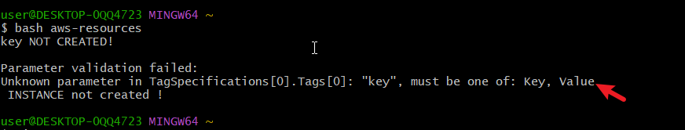

# AWS Automation Using Shell Scripting

## Overview

This script automates the setup of various AWS infrastructure components including security groups, EC2 instances, S3 buckets,
and IAM users and groups. It is designed to be flexible and can be used in different environments such as local, testing, and production.


## Usage

The script takes one argument which specifies the environment (local, testing, or production). Depending on the environment, the script will create the necessary AWS resources.

### Running the Script

```bash
./aws_cloud_manager.sh <environment>
```

Replace `<environment>` with either `local`, `testing`, or `production`.


### Functions

#### `check_num_of_args`

Checks if the correct number of arguments are passed to the script.

```bash
check_num_of_args() {
    if [ "$#" -ne 1 ]; then
        echo "Usage: $0 <environment>"
        exit 1
    fi
}
```

#### `activate_infra_environment`

Activates the appropriate environment based on the user input.

```bash
activate_infra_environment() {
    case "$ENVIRONMENT" in
        local)
            echo "Running script for Local Environment..."
            ;;
        testing)
            echo "Running script for Testing Environment..."
            ;;
        production)
            echo "Running script for Production Environment..."
            ;;
        *)
            echo "Invalid environment specified. Please use 'local', 'testing', or 'production'."
            exit 2
            ;;
    esac
}
```

#### `check_aws_cli`

Checks if AWS CLI is installed.

```bash
check_aws_cli() {
    if ! command -v aws &> /dev/null; then
        echo "AWS CLI is not installed. Please install it before proceeding."
        exit 1
    fi
}
```

#### `check_aws_profile`

Checks if the AWS profile environment variable is set.

```bash
check_aws_profile() {
    if [ -z "$AWS_PROFILE" ]; then
        echo "AWS profile environment variable is not set. Please set an AWS profile."
        exit 1
    else
        echo "Using AWS_PROFILE=$AWS_PROFILE"
    fi
}
```

#### Create_security_group

Creates a security group with SSH and HTTP access rules.

```bash
create_security_group() {
    local sg_name="${SECURITY_GROUP_NAME:-datawise-security-group}"
    local sg_description="${SECURITY_GROUP_DESCRIPTION:-Security group for Datawise project}"
    local vpc_id=$(aws ec2 describe-vpcs --query 'Vpcs[0].VpcId' --output text)

    sg_id=$(aws ec2 create-security-group --group-name "$sg_name" --description "$sg_description" --vpc-id "$vpc_id" --query 'GroupId' --output text)
    if [ $? -ne 0 ]; then
        echo "Failed to create security group: $sg_name" >&2
        exit 1
    fi

    aws ec2 authorize-security-group-ingress --group-id "$sg_id" --protocol tcp --port 22 --cidr 0.0.0.0/0
    aws ec2 authorize-security-group-ingress --group-id "$sg_id" --protocol tcp --port 80 --cidr 0.0.0.0/0
    if [ $? -ne 0 ]; then
        echo "Failed to set security group rules."
        exit 1
    fi

    echo "Security group created with ID: $sg_id"
}
```

#### Create key Pair

Creates a new key pair for SSH access to EC2 instances.

```bash
create_key_pair() {
    local key_name="${1:-test-keypair}"
    if ! aws ec2 describe-key-pairs --key-names "$key_name" &> /dev/null; then
        aws ec2 create-key-pair --key-name "$key_name" --query 'KeyMaterial' --output text > "$key_name.pem" \
        && chmod 400 "$key_name.pem" \
        && echo "Key pair created and saved as $key_name.pem" \
        || echo "Failed to create key pair."
    else
        echo "Key pair '$key_name' already exists."
    fi
}
```

#### `create_ec2_instances`

Creates EC2 instances with specified AMIs and tags.

```bash
create_ec2_instances() {
    local ami_ids=(
        "ami-08a0d1e16fc3f61ea"  # Amazon Linux
        "ami-04b70fa74e45c3917"  # Ubuntu
        "ami-002070d43b0a4f171"  # CentOS
    )
    local instance_type="t2.micro"
    local count=1
    local region="us-east-1"
    local key_name="test-keypair"
    local instance_names=("AmazonLinuxInstance" "UbuntuInstance" "CentOSInstance")

    for i in "${!ami_ids[@]}"; do
        local ami_id="${ami_ids[$i]}"
        local instance_name="${instance_names[$i]}"

        echo "Creating EC2 instance with AMI $ami_id and Name tag $instance_name..."

        instance_id=$(aws ec2 run-instances \
            --image-id "$ami_id" \
            --instance-type "$instance_type" \
            --count "$count" \
            --region "$region" \
            --key-name "$key_name" \
            --security-group-ids "$sg_id" \
            --tag-specifications "ResourceType=instance,Tags=[{Key=Name,Value=$instance_name}]" \
            --query 'Instances[0].InstanceId' \
            --output text)

        if [ $? -eq 0 ]; then
            echo "EC2 instance created successfully with AMI $ami_id. Instance ID: $instance_id"
        else
            echo "Failed to create EC2 instance with AMI $ami_id."
            exit 1
        fi
    done
}
```

#### `create_s3_buckets`

Creates S3 buckets for different departments.

```bash
create_s3_buckets() {
    local company="datawise"
    local departments=("marketing" "sales" "hr" "operations" "media")

    for department in "${departments[@]}"; do
        local bucket_name="${company}-${department}-data-bucket"
        aws s3api create-bucket --bucket "$bucket_name" --region us-east-1
        if [ $? -eq 0 ]; then
            echo "S3 bucket '$bucket_name' created successfully."
        else
            echo "Failed to create S3 bucket '$bucket_name'."
        fi
    done
}
```

#### `wait_for_instance`

Waits until an instance is ready for SSH.

```bash
wait_for_instance() {
    local instance_id=$1
    local max_attempts=40
    local attempt=1

    echo "Waiting for instance $instance_id to be ready for SSH..."
    while (( attempt <= max_attempts )); do
        local instance_state=$(aws ec2 describe-instances --instance-ids "$instance_id" --query 'Reservations[*].Instances[*].State.Name' --output text)
        local public_ip=$(aws ec2 describe-instances --instance-ids "$instance_id" --query 'Reservations[*].Instances[*].PublicIpAddress' --output text)

        if [[ "$instance_state" == "running" && -n "$public_ip" ]]; then
            echo "Instance $instance_id is ready for SSH."
            return 0
        fi

        echo "Instance $instance_id is not ready yet. Retrying in 15 seconds..."
        sleep 15
        attempt=$((attempt + 1))
    done

    echo "Instance $instance_id did not become ready in time."
    return 1
}
```

#### `upload_script_to_instances`

Uploads a specified script to all EC2 instances.

```bash
upload_script_to_instances() {
    local instance_names=("AmazonLinuxInstance" "UbuntuInstance

" "CentOSInstance")

    for instance_name in "${instance_names[@]}"; do
        instance_id=$(aws ec2 describe-instances --filters "Name=tag:Name,Values=$instance_name" --query 'Reservations[*].Instances[*].InstanceId' --output text)
        public_ip=$(aws ec2 describe-instances --instance-ids "$instance_id" --query 'Reservations[*].Instances[*].PublicIpAddress' --output text)

        if [ -n "$public_ip" ]; then
            wait_for_instance "$instance_id"
            echo "Uploading script to instance $instance_id ($instance_name) at $public_ip..."

            local user
            case "$instance_name" in
                AmazonLinuxInstance)
                    user="ec2-user"
                    ;;
                UbuntuInstance)
                    user="ubuntu"
                    ;;
                CentOSInstance)
                    user="centos"
                    ;;
                *)
                    echo "Unknown instance name: $instance_name"
                    return 1
                    ;;
            esac

            scp -i "test-keypair.pem" script.sh "$user@$public_ip:/home/$user/"
            if [ $? -eq 0 ]; then
                echo "Script uploaded successfully to instance $instance_id ($instance_name)."
            else
                echo "Failed to upload script to instance $instance_id ($instance_name)."
                return 1
            fi
        else
            echo "No public IP found for instance $instance_id ($instance_name)."
        fi
    done
}
```

#### `execute_script_on_instances`

Executes the uploaded script on all EC2 instances.

```bash
execute_script_on_instances() {
    local instance_names=("AmazonLinuxInstance" "UbuntuInstance" "CentOSInstance")

    for instance_name in "${instance_names[@]}"; do
        instance_id=$(aws ec2 describe-instances --filters "Name=tag:Name,Values=$instance_name" --query 'Reservations[*].Instances[*].InstanceId' --output text)
        public_ip=$(aws ec2 describe-instances --instance-ids "$instance_id" --query 'Reservations[*].Instances[*].PublicIpAddress' --output text)

        if [ -n "$public_ip" ]; then
            wait_for_instance "$instance_id"
            echo "Executing script on instance $instance_id ($instance_name) at $public_ip..."

            local user
            case "$instance_name" in
                AmazonLinuxInstance)
                    user="ec2-user"
                    ;;
                UbuntuInstance)
                    user="ubuntu"
                    ;;
                CentOSInstance)
                    user="centos"
                    ;;
                *)
                    echo "Unknown instance name: $instance_name"
                    return 1
                    ;;
            esac

            ssh -i "test-keypair.pem" "$user@$public_ip" "bash /home/$user/script.sh"
            if [ $? -eq 0 ]; then
                echo "Script executed successfully on instance $instance_id ($instance_name)."
            else
                echo "Failed to execute script on instance $instance_id ($instance_name)."
                return 1
            fi
        else
            echo "No public IP found for instance $instance_id ($instance_name)."
        fi
    done
}
```

#### `verify web application accessibility``

```bash
verify_web_app_access() {
    local instance_names=("AmazonLinuxInstance" "UbuntuInstance" "CentOSInstance")

    for instance_name in "${instance_names[@]}"; do
        local instance_id=$(aws ec2 describe-tags --filters "Name=tag:Name,Values=$instance_name" --query 'Tags[0].ResourceId' --output text)
        local public_ip=$(aws ec2 describe-instances --instance-ids "$instance_id" --query 'Reservations[*].Instances[*].PublicIpAddress' --output text)
        
        response=$(curl -s -o /dev/null -w "%{http_code}" "http://$public_ip")
        
        if [ "$response" -eq 200 ]; then
            echo "Web application is accessible on instance $instance_id ($instance_name)."
        else
            echo "Web application is not accessible on instance $instance_id ($instance_name)."
            exit 1
        fi
    done
}
```

## Create IAM users and IAM group


```bash

#!/bin/bash

#Creates IAM users
create_iam_users() {
    iam_user_names=("Ekemini" "Miriam" "Uche" "Rena" "Thompson") #storing the names of the IAM users in an array 

    for username in "${iam_user_names[@]}"; do
        #iterating through the array names to create IAM users 
        echo "Creating IAM user: $username..."
        aws iam create-user --user-name "$username"
        if [ $? -eq 0 ]; then #checks if previous command was successful
            echo "IAM user $username created successfully."
        else
            echo "Failed to create IAM user $username."
            exit 1
        fi
    done
}


#Creates an IAM group.

create_iam_group() {
    echo "Creating IAM group: admin..."
    aws iam create-group --group-name admin 
    if [ $? -eq 0 ]; then
        echo "IAM group admin created successfully."
    else
        echo "Failed to create IAM group admin."
        exit 1
    fi
}


#attach admin policy to group

#Attaches the AdministratorAccess policy to the IAM group.


attach_admin_policy_to_group() {
    echo "Attaching AdministratorAccess policy to group admin..."
    aws iam attach-group-policy --group-name admin --policy-arn arn:aws:iam::aws:policy/AdministratorAccess
    if [ $? -eq 0 ]; then
        echo "AdministratorAccess policy attached to group admin."
    else
        echo "Failed to attach AdministratorAccess policy to group admin."
        exit 1
    fi
}


#assign users to group


assign_users_to_group() {
    iam_user_names=("Ekemini" "Miriam" "Uche" "Rena" "Thompson")

    for username in "${iam_user_names[@]}"; do
        echo "Adding user $username to group admin..."
        aws iam add-user-to-group --user-name "$username" --group-name admin
        if [ $? -eq 0 ]; then
            echo "User $username added to group admin."
        else
            echo "Failed to add user $username to group admin."
            exit 1
        fi
    done
}


#call the functions to create IAM users and groups

create_iam_users
create_iam_group

#call function to attach admin policy to group and assign users to earlier created group
attach_admin_policy_to_group
assign_users_to_group


```

#### Uploaded and executed a script on EC2 instances to install and configure Apache 

```bash
#!/bin/bash

# Function to update and install Apache web server based on the OS
install_apache() {
    if [ -f /etc/os-release ]; then
        . /etc/os-release
        OS=$ID
    else
        echo "Unable to detect the operating system."
        exit 1
    fi

    case "$OS" in
        amzn)
            # Amazon Linux
            sudo yum update -y
            sudo yum install -y httpd
            sudo systemctl start httpd
            sudo systemctl enable httpd
            ;;
        ubuntu)
            # Ubuntu
            sudo apt-get update -y
            sudo apt-get install -y apache2
            sudo systemctl start apache2
            sudo systemctl enable apache2
            ;;
        centos)
            # CentOS
            sudo yum update -y
            sudo yum install -y httpd
            sudo systemctl start httpd
            sudo systemctl enable httpd
            ;;
        *)
            echo "Unsupported operating system: $OS"
            exit 1
            ;;
    esac

  
### Main Execution

Combines all functions to execute the entire script.

```bash
install_apache
```

## TROUBLESHOOTING

- Indentication is very important, always check it i.e always check the spacing especially when indented.
- Test script while still developing the code. Always test at each milestone, that way its easier to debug each step and be sure its functioning appropriately before adding another one.  
- Always take note of colours and colour change, it could help you identify a mistake on time
- Add the sleep 1 command where necessary
- Error can occur due to case disparity, hence always ensure you are using the right, uppercase or lowercase as the command require, keeping in that the commands and bash are generally case sensitive. Uppercase and Lowercase of the same letter will produce different results
 

