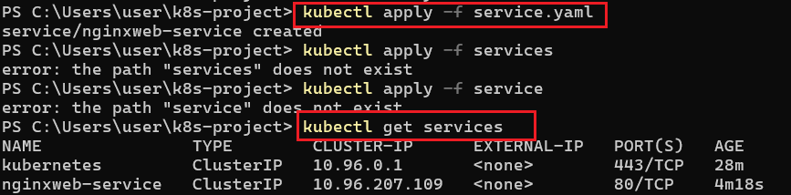
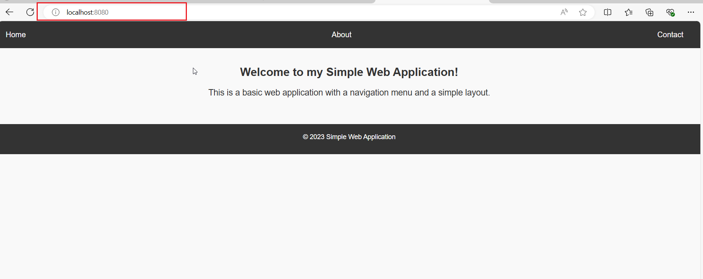

# **Capstone Project - Containerization and Container Orchestration**

## Project Requirement
Basic Frontend Application with Docker and Kubernetes

You are developing a simple static website (HTML and CSS) for a company's landing page. The goal is to containerize this application using Docker, deploy it to a Kubernetes cluster, and access it through Nginx.

## Set up your project
-	Create a new project directory.

```
mkdir my-project
```


- Inside the directory, create an HTML file (index.html) and a CSS file (styles.css).

```
cd my-project
```
```
touch index.html 
touch style.css
```

## Initialize Git
-	Initialize a Git repository in your project directory.

```
git init
```

## Git Commit
-	Add and commit your initial code to the Git repository.

```
git add .
git commit -m "Initial commit" .
```
## Dockerize the application
-	Create a dockerfile specifying Nginx as the base image.


A Dockerfile is a plaintext configuration file that contains a set of instructions for building a Docker image. It serves as a blueprint for creating a reproducible and consistent environment for your application. Dockerfiles are fundamental to the containerization process, allowing you to define the steps to assemble an image that encapsulates your application and its dependencies.

```
vim dockerfile
```


- Copy and paste the below into the dockerfile
```
FROM nginx:latest
WORKDIR  /usr/share/nginx/html/

COPY index.html /usr/share/nginx/html/
COPY styles.css /usr/share/nginx/html/

EXPOSE 80

# No need for CMD as NGINX image comes with a default CMD to start the server
```
Explanation of the code snippet above
1.	FROM nginx:latest: Specifies the official NGINX base image from Docker Hub.
2.	WORKDIR /usr/share/nginx/html/: Specifies the working directory in the container
3.	COPY index.html /usr/share/nginx/html/: Copies the local index.html file to the NGINX default public directory, which is where NGINX serves static content from.
4.	EXPOSE 80: Informs Docker that the NGINX server will use port 80. This is a documentation feature and doesn't actually publish the port.
5.	CMD: NGINX images come with a default CMD to start the server, so there's no need to specify it explicitly. CMD is used to state the starting point or the command to run first when starting the app.
6. Entrypoint: Does the same thing as CMD

#### Difference between Entrypoint and CMD
They both serve as your starting point or used to state the commands to run first when starting the app but CMD can be overrided while Entrypoint **can not** be bypassed. CMD can be passed by using a code that overrides in the terminal.


-	Copy your HTML and CSS files into the Nginx HTML directory. (Use ChatGPT to generate a basic HTML and CSS code for a simple web application)

```
vim index.html
```
Copy and paste the below code into the index.html to create a simple website

```
<!DOCTYPE html>
<html lang="en">
<head>
    <meta charset="UTF-8">
    <meta name="viewport" content="width=device-width, initial-scale=1.0">
    <title>Simple Web Application</title>
    <link rel="stylesheet" href="styles.css">
</head>
<body>
    <header>
        <nav>
            <ul>
                <li><a href="#">Home</a></li>
                <li><a href="#">About</a></li>
                <li><a href="#">Contact</a></li>
            </ul>
        </nav>
    </header>
    <main>
        <h1>Welcome to my Simple Web Application!</h1>
        <p>This is a basic web application with a navigation menu and a simple layout.</p>
    </main>
    <footer>
        <p>&copy; 2023 Simple Web Application</p>
    </footer>
</body>
</html>
```
```
vim style.css
```
Copy and paste the below code into the style.css
```
/* Global Styles */

* {
    box-sizing: border-box;
    margin: 0;
    padding: 0;
}

body {
    font-family: Arial, sans-serif;
    line-height: 1.6;
    color: #333;
    background-color: #f9f9f9;
}

/* Header Styles */

header {
    background-color: #333;
    color: #fff;
    padding: 1em;
    text-align: center;
}

header nav ul {
    list-style: none;
    margin: 0;
    padding: 0;
    display: flex;
    justify-content: space-between;
}

header nav li {
    margin-right: 20px;
}

header nav a {
    color: #fff;
    text-decoration: none;
}

header nav a:hover {
    color: #ccc;
}

/* Main Styles */

main {
    display: flex;
    flex-direction: column;
    align-items: center;
    padding: 2em;
}

main h1 {
    font-size: 24px;
    margin-bottom: 10px;
}

main p {
    font-size: 18px;
    margin-bottom: 20px;
}

/* Footer Styles */

footer {
    background-color: #333;
    color: #fff;
    padding: 1em;
    text-align: center;
    clear: both;
}

footer p {
    font-size: 14px;
    margin-bottom: 10px;
}
```

## Push to Docker Hub
-	Log in to Docker Hub.

```
docker login
```
Provide your Docker Hub credentials when prompted.
-	Push your Docker image to Docker Hub.
```
docker build -t your-dockerhub-username/my-nginx-app .
docker push your-dockerhub-username/my-nginx-app
```
>NOTE:
>Replace 'your-dockerhub-username' with your actual Docker Hub username. Replace my-nginx-app with any name you want to give your app e.g nginxweb-app


## Set up a Kind Kubernetes Cluster
-	Install Kind (Kubernetes in Docker).
Follow the installation instructions for kind specific to your operating system: https://kind.sigs.k8s.io/docs/user/quick-start/#installation

```
#using choco to install kind
choco install kind -y
```
>[!NOTE] 
>Ensure you open your terminal as 'Run as administrator' before trying to install kind using choco.


-	Create a Kind cluster.
```
kind create cluster
```


## Deploy to Kubernetes
-	Create a Kubernetes Deployment YAML file specifying the image and desired replicas.
```
vim deployment.yaml
```
```
apiVersion: apps/v1
kind: Deployment
metadata:
  name: nginxweb-app
spec:
  replicas: 1
  selector:
    matchLabels:
      app: nginxweb-app
  template:
    metadata:
      labels:
        app: nginxweb-app
    spec:
      containers:
      - name: nginxweb-app
        image: your-dockerhub-username/my-nginx-app
        ports:
        - containerPort: 80
```
>NOTE:
>Replace 'your-dockerhub-username' with your actual Docker Hub username. Replace my-nginx-app with any name you want to give your app e.g nginxweb-app


Let me explain what each section of this YAML file does:

1. apiVersion and kind specify the type of Kubernetes object we're creating (in this case, a Deployment).

2. metadata provides metadata about the Deployment, such as its name.

3. spec specifies the desired state of the Deployment.

4. replicas specifies the number of replicas (i.e., copies) of the application we want to run.
selector specifies the label selector that identifies the pods that this Deployment manages.
template specifies the template for the pods that this Deployment creates.

5. metadata and labels within the template section specify the metadata and labels for the pods.
spec within the template section specifies the container(s) that run within the pod.

6. containers specifies the container(s) that run within the pod.

7. name specifies the name of the container.
image specifies the Docker image that the container runs.

8. ports specifies the port(s) that the container exposes.

-	Apply the deployment to your cluster. This will create pod
```
kubectl apply -f deployment.yaml

```


## Create a Service (ClusterIP)
-	Create a Kubernetes Service YAML file specifying the type as ClusterIP.
```
vim service.yaml
```
```
apiVersion: v1
kind: Service
metadata:
  name: nginxweb-service
spec:
  selector:
    app: nginxweb-app
  ports:
  - protocol: TCP
    port: 80
    targetPort: 80
  type: ClusterIP
```


Let me explain what each section of this YAML file does:

1. apiVersion and kind specify the type of Kubernetes object we're creating (in this case, a Service).

2. metadata provides metadata about the Service, such as its name.

3. spec specifies the desired state of the Service.
selector specifies the label selector that identifies the pods that this Service targets.
ports specifies the port(s) that the Service exposes.

4. name specifies the name of the port.
port specifies the port number that the Service exposes.

5. targetPort specifies the port number that the pods listen on.

6. type specifies the type of Service. In this case, we're creating a LoadBalancer Service, which exposes the Service externally using a cloud provider's load balancer.


-	Apply the service to your cluster.

```
kubectl apply -f service.yaml
```


To see the pods created:
```
kubectl get pods
```


To get more details and ip address of the pod:
```
kubectl get pods -0 wide
```


To get advanced details about the pod:
```
kubectl get pods -v=7
```
**or**
```
kubectl get pods -v=9
```


## Access the Application
-	Port-forward to the service to access the application locally. There are two methods that can be used:

```
kubectl port-forward service/my-nginxweb-service 8080:80
```
OR

```
kubectl port-forward pod/podname(e.g nginxweb-app-79b668888b-ds4f4) 8080:80
```


-	Open your browser and visit the specified port to view your simple frontend application.

 Open the browser and visit `http://localhost:8080` to view the simple frontend application.

 

Now you have a Dockerized Nginx web server running your HTML and CSS files in a Kubernetes cluster using kind.

## TROUBLESHOOTING

1. To install kind through choco, you have to open the terminal as "Run as administrator" 

2. When installing kind add -y to avoid question promts, so it can install easily 

3. Error due inability to pull docker image:

This occurred when tried to port-forward to service, I noticed I used the wrong name for the image hence it couldnot access my image. i rebuilt the image using the right namen not forget fullstop(.) which means present directory. 
```
docker build -t your-dockerhub-username/my-nginx-app .
```
```
docker push your-dockerhub-username/my-nginx-app
```

Then,I pushed to dockerhub and deleted the wrong image, I reapplied the deployment.yaml and service.yaml again.

4. Ensure your Docker desktop is open as your are creating the image and working on this project.

5. In the docker build command, always include the directory(use "." if it is in the present directory)
e.g
```
docker build -t dockerfile .
```


