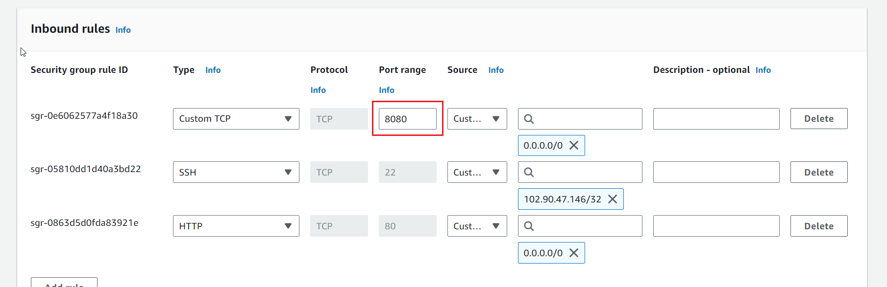
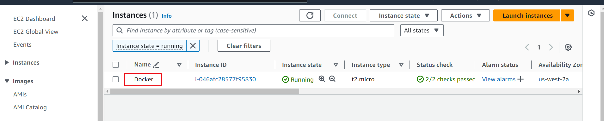
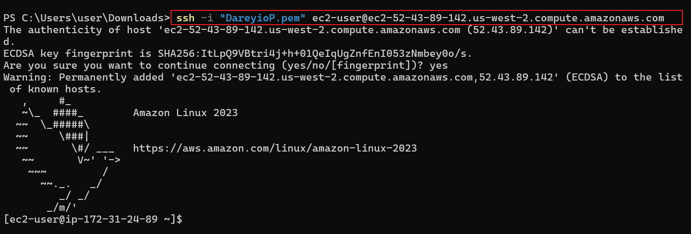
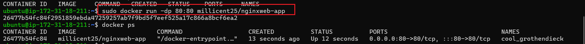
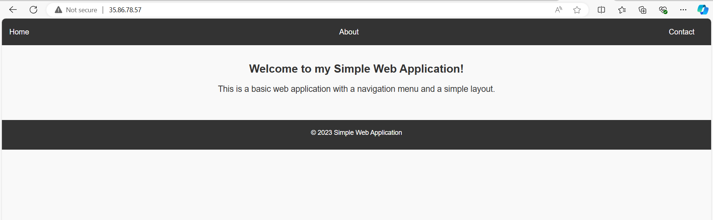

# **DOCKER PROJECT**

Overview

This project is the recreate the the website in project6(containerization) using Docker. It is a continuation from project6. Hence, we will using the docker image created earlier in the kubernetes project for this. EC2 instance will be used to host the docker container.

## **Create Security Group for the EC2**
- Allow ssh from your ip address(your laptop)
- Allow http from anywhere
- Allow TCP from port 8080 , source from anywhere. This is because the port that the docker image is to be veiwed from, according to the dockerfile used to create the image is port 8080. hence traffic from the port 8080 **must** be allowed in the security group of this EC2 instance.



>[!NOTE]
>Any port specified on your dockerfile as the port for the application, traffic from that particular port must be allowed on the security group of the EC2 instance to host the docker container. If not, the application or website cannot be viewed over the internet, even though http and https has been allowed in the SG of the instance.

## **Create EC2 instance and SSH into the instance**

- Create EC2 instance named Docker using ubuntu ami



- SSH into the instance



## **Install Docker on your Instance** 

- First, update the package index on your Ubuntu instance:

```
sudo apt update
```
- Install Prerequisites
Install the necessary packages for allowing apt to use packages over HTTPS (optional if you won't be using https for your website)

```
sudo apt install apt-transport-https ca-certificates curl software-properties-common
```

- Add Docker's Official GPG Key
Add Docker’s official GPG key:

```
curl -fsSL https://download.docker.com/linux/ubuntu/gpg | sudo apt-key add -
```

- Add the Docker APT Repository.
Add the Docker repository to your system:

```
sudo add-apt-repository "deb [arch=amd64] https://download.docker.com/linux/ubuntu $(lsb_release -cs) stable"
```

- Update the Package Index Again.
Update the package index again to include the Docker packages:

```
sudo apt update
```
- Now install Docker:
```
sudo apt install docker-ce
```

- Start and Enable Docker Service.
Start the Docker service and enable it to run at boot:

```
sudo systemctl start docker
sudo systemctl enable docker
```

- Verify Docker Installation.
Check if Docker is installed correctly by running:

```
sudo docker --version
```
- Manage Docker as a Non-root User.
To allow you to run Docker commands without sudo, add your user to the docker group:

```
sudo usermod -aG docker $USER
```
>[!NOTE]
>After running this command, log out and back into the instance for the group change to take effect.

## **Pull Image from Dockerhub**


Docker images are the building blocks of containers. They are lightweight, portable, and self-sufficient packages that contain everything needed to run a software application, including the code, runtime, libraries, and system tools. Images are created from a set of instructions known as a Dockerfile, which specifies the environment and configuration for the application.


Since our docker image for this project is in our private dockerhub. The image was created in the earlier project(containerization using kubernetes). We will first log into our private dockerhub account before pulling the image.

- Log into your private dockerhub account
- Pull the docker image
```
docker pull image-name
```
- View the image to ensure it has been pulled
```
docker images
```

- The dockerfile used for this image reads thus:
```
FROM nginx:latest
WORKDIR  /usr/share/nginx/html/

COPY index.html /usr/share/nginx/html/
COPY styles.css /usr/share/nginx/html/

EXPOSE 8080

# No need for CMD as NGINX image comes with a default CMD to start the server
```
**OR**

```
FROM nginx:latest
WORKDIR  /usr/share/nginx/html/

COPY ..

EXPOSE 8080

# No need for CMD as NGINX image comes with a default CMD to start the server
```


>>Note: An index.html file and style.css file for a simple website was in the same directory while creating the image, hence the docker-image created has both the index.html file, style.css file and the dependencies for the app or website in it.


Explanation of the code snippet above
1.	FROM nginx:latest: Specifies the official NGINX base image from Docker Hub.
2.	WORKDIR (/usr/share/nginx/html/): Specifies the working directory in the container
3.	COPY (index.html /usr/share/nginx/html/ or ..): Copies the local index.html file to the NGINX default public directory, which is where NGINX serves static content from. The **".."** in the second example means "present directory" i.e copy all the files in the present directory.
4.	EXPOSE 80: Informs Docker that the NGINX server will use port 80. This is a documentation feature and doesn't actually publish the port.
5.	CMD: NGINX images come with a default CMD to start the server, so there's no need to specify it explicitly. CMD is used to state the starting point or the command to run first when starting the app.
6. Entrypoint: Does the same thing as CMD

### Difference between Entrypoint and CMD
They both serve as your starting point or used to state the commands to run first when starting the app but CMD can be overrided while Entrypoint **can not** be bypassed. CMD can be passed by using a code that overrides in the terminal.

## **Run the Pulled Docker-image**

```
docker run -dp 8080:8080 image-name
```
- The **"-d"** means run in detached mode.
- The **"p"** means port which is 8080:8080 i.e it is being assigned to port 8080 which is the specified for the app in the dockerfile provided.



- View the container
```
docker ps
```

## **View the Website over the Internet**

- Copy the public ip address of the EC2 instance and paste on your web browser



## END OF PROJECT

### Volume in Docker
 
```
 docker volume create volume-name
```
This will create an invisible file system 
- To see the file system use the command:
```
docker volume ls
```
- To check the details of the volume

```
docker volume inspect volume-name
```
- To view the details of the container including it's volumes which you will find under the **mount** section:
```
docker inspect container
```
- To delete the volume
```
docker volume rm volume-name
```
