# IMPLEMENT PACKER TO CALL SHELL SCRIPTS

Packer is an open-source tool developed by HashiCorp that automates the creation of machine images for multiple platforms from a single source configuration. It enables you to package applications, server configurations, and dependencies into reusable images that can be deployed across various environments.

### Key Features of Packer:
- Multi-Platform Support: Packer supports various platforms, including cloud providers (like AWS, Azure, GCP), virtualization platforms (like VMware, VirtualBox), and container formats (like Docker).
- Infrastructure as Code: Packer allows you to define your machine images using a simple configuration file (in JSON or HCL format), enabling version control and collaborative workflows.
- Automation: It automates the entire image creation process, reducing manual work and the chances of human error. This leads to consistent and repeatable builds.
- Provisioners: Packer uses provisioners to install and configure software on the machine image. This can include shell scripts, configuration management tools (like Ansible, Chef, or Puppet), or cloud-init scripts.
- Speed: Packer can create images quickly by leveraging parallel execution and caching. This makes it suitable for rapid development and deployment cycles.

## Background Scenario for this Project

You have been assigned to develop a Finance website. Your objective is to utilize Packer to create AMI, develop the platform in a linux environment and deploy it on an AWS EC2 instance. Git will be used for version control. You are to use any suitable website template to kickstart your development. Free sample template can be found at: [Tooplate](https://tooplate.com) 

## Project Pre-requisite
-	Knowledge of AWS and AMI
-	AWS CLI must be downloaded and configured on your IDE(VScode)
- Packer must be pre-installed


## Initialize Git Repository

Begin by creating directory for the project. Open VScode, create a directory and name the directory "Packer". Navigate into the directory and initialize a Git repository to manage version control.

```
mkdir Packer
cd Packer
git init
```
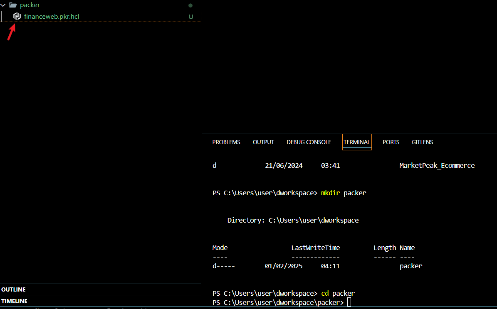

- Create a packer file named "financeweb.pkr.hcl" and push to Git

```
git add .
git config --global user.name "YourUsername"
git config --global user.email "Youremail@example.com"
git commit -m "initial commit for packer"
git push origin main
```
## Edit the Packer file 
Edit the financeweb.pkr.hcl file, use packer's official documentation as guide to create the content of the Packer file. 
Navigate to Packer's official website ([packer.io](https://packer.io)), Click on "tutorials", by the left, click on "AWS" and then, click on "Build an image". Copy and paste the official example, then edit to suite your project.

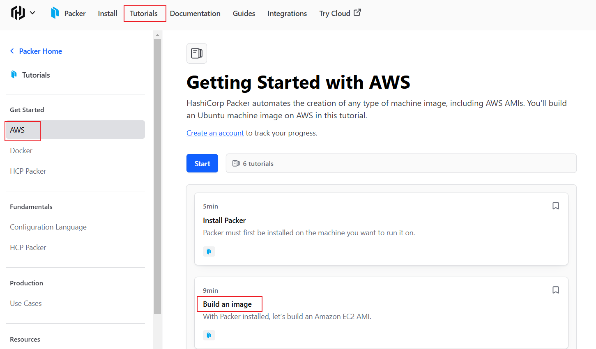

For this particular project, copy and paste the below into your financeweb.pkr.hcl:

```
packer {
  required_plugins {
    amazon = {
      version = ">= 1.2.8"
      source  = "github.com/hashicorp/amazon"
    }
  }
}

locals {
  timestamp = regex_replace(timestamp(), "[- TZ:]", "")
}


source "amazon-ebs" "financeweb" {
  ami_name      = "financeweb-packer-linux-${local.timestamp}"
  instance_type = "t2.micro"
  region        = "us-west-2"
  source_ami_filter {
    filters = {
      name                = "al2023-ami-2023.*.*.0-kernel-6.1-x86_64"
      root-device-type    = "ebs"
      virtualization-type = "hvm"
    }
    most_recent = true
    owners      = ["137112412989"]
  }
  ssh_username = "ec2-user"
}

build {
  sources = [
    "source.amazon-ebs.financeweb"
  ]

  provisioner "file" {
    source = "../Finance_website"
    destination = "/home/ec2-user/Finance_website"

  }

  provisioner "shell" {
    script = "./app.sh"


  }


}

```
## Breakdown and Explanation of each Packer file components

1. **Packer Block:**

```
packer {
  required_plugins {
    amazon = {
      version = ">= 1.2.8"
      source  = "github.com/hashicorp/amazon"
    }
  }
}
```
This block specifies that the Amazon plugin is required, with a version constraint indicating that it should be version 1.2.8 or higher.

2. **Local Variables:**

```
locals {
  timestamp = regex_replace(timestamp(), "[- TZ:]", "")
}
```
Defines a local variable timestamp that formats the current timestamp. This is useful for generating a unique AMI name. This unique AMI name is important as it makes the script dynamic and reuseable without having to always edit the AMI name before creating any new version for the AMI.

To add the timestamp variable, on the packer official website, click on "tutorial", select "AWS", then click on "Variable"

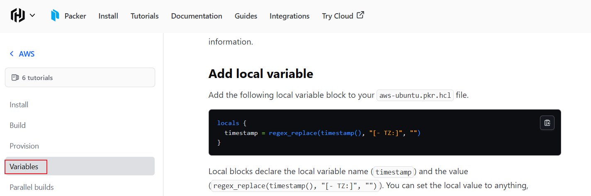

3. **Source Block:**

```
source "amazon-ebs" "financeweb" {
  ami_name      = "financeweb-packer-linux-${local.timestamp}"
  instance_type = "t2.micro"
  region        = "us-west-2"
  source_ami_filter {
    filters = {
      name                = "al2023-ami-2023.*.*.0-kernel-6.1-x86_64"
      root-device-type    = "ebs"
      virtualization-type = "hvm"
    }
    most_recent = true
    owners      = ["137112412989"]
  }
  ssh_username = "ec2-user"
}
```

This block defines the source configuration for creating the AMI:

- ami_name: The name of the AMI, which includes the formatted timestamp. Note the ami_name must be edited to remove the specific version number and replace it with a  *, in order t0 ensure the AMI is dynamic which is the essence of the source_ami_filter component.

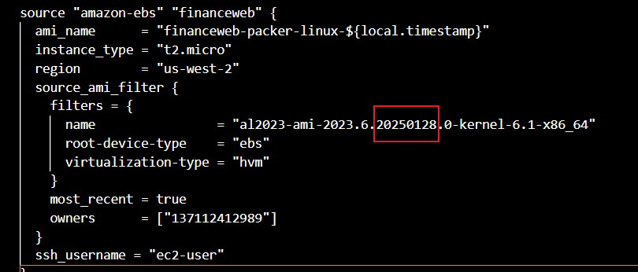

- instance_type: Specifies the EC2 instance type to use (in this case, t2.micro).

- region: The AWS region where the AMI will be created (us-west-2).

- source_ami_filter: Filters to find the latest Amazon Linux 2023 AMI.This make the base image dynamic and suitable for any region. It ensures it always has the late version of the AMI. To get the details for the source_ami_filter, on your AWS console, navigate to AMI. Click on the "Owned by me" dropdown and select "public images". Paste the AMI ID of the AMI you want to get its details on the filter section. Click on the AMI needed to expose its details.

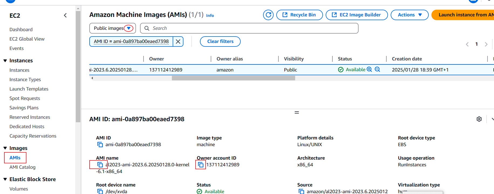


- ssh_username: The username to use for SSH access to the instance.

>>Note: in this case "ec2-user" is used because we are using Amazon Linux as our base image. If you change the base image, the ssh_username will change.

4. **Build Block:**

```
build {
  sources = [
    "source.amazon-ebs.financeweb"
  ]

  provisioner "file" {
    source = "../Finance_website"
    destination = "/home/ec2-user/Finance_website"
  }

  provisioner "shell" {
    script = "./app.sh"
  }
}
```

This block defines the build process for the AMI:

- sources: References the previously defined source.

- provisioner "file": The section is used to copy file into the AMI during creation. It Copies the local Finance_website directory to the specified path on the EC2 instance as indicated in this file provisioner section. For this project, this file contains the html and css file for the website creation. The ".." in "../Finance_website", signifies the file we are referencing is not in the same directory as the packer file(financewe.pkr.hcl) but in a previous directory. Source represents the path the file will be copied from while destination represents, the path it should be copied into

- provisioner "shell": Executes a shell script (app.sh) on the EC2 instance, allowing further configuration or setup after the file is transferred. This represents the series of shell commands that should be executed after the file has been uploaded.

>>Note: The components will be executed in the order that it is written. The file will be uploaded first before the shell commands can be executed because the "file provisioner" is before the shell provisioner, but if you want the shell script to be executed first, you will have reorder the "shell provisioner" to come before the file provisioner.  


## **Add the File(Finance_website) to the Path you referenced in your File Provisioner section**  

Since the file containing the source code is in your Git repository, you will have to clone the Git repository where the source code is but first cd out of the the packer repository.

```
cd ..
```
In your GitHub account, navigate to the Git repository where the source code is, click on "code" and select "http". Copy the http code

```
git clone https://github.com/Millicentchinelo/Finance_website.git
```
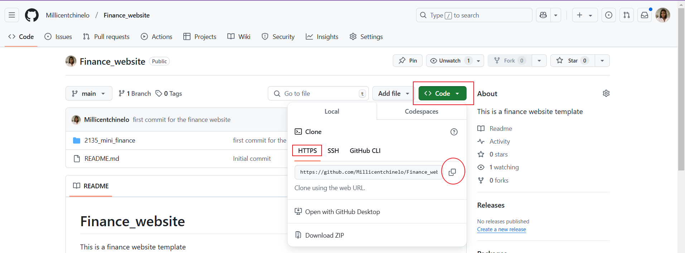

Now when you "ls", you will see the Finance_website present in your directory

```
ls
```

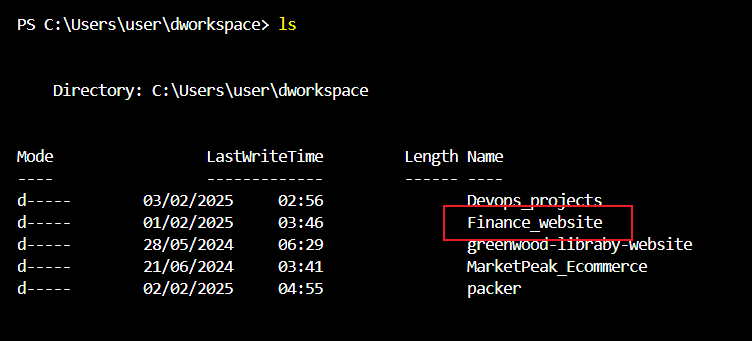

>>Note: The finance_webite file is present in the directory as represented in the packer file.

## **Cd into the packer directory and create a shell scripting file called app.sh**

 
 ```
 cd packer
 ```
 In this app.sh file, you will write all the shell commands you want to execute on the EC2
 Copy and paste the below code.

 ```
#!/bin/bash

sleep 30

sudo yum update -y
#install unzip 
#cd into the home directory and unzip the file
#sudo yum install unzip -y
#cd ~/ && unzip Finance_website.zip


# the below commands updates the linux server and then installs httpd (Apache), starts the web server,
# and ensures it automatically starts on server boot

sudo yum install httpd -y
sudo systemctl start httpd
sudo systemctl enable httpd

#Clear the default httpd web directory and copy Finance website files to it.

sudo rm -rf /var/www/html/*
sudo cp -r ~/Finance_website/* /var/www/html/
sudo systemctl reload httpd

 ```

>>NOTE: It is important to start the shell script with a sleep command for 30seconds in order to allow time for the EC2 instance to be fully configured and running, before executing the commands.

## Initialize and build packer

```
packer init
```
```
packer build financeweb.pkr.hcl
```
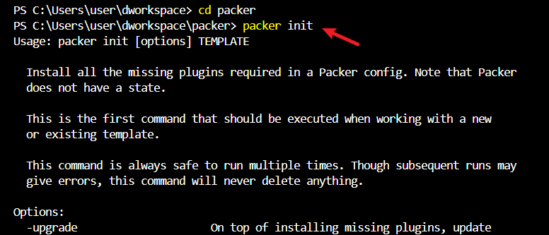

## **Deploy EC2 Instance from the AMI**

Navigate to EC2 dashboard, click on AMIs and select the AMI just created. By the right, select launch instance from AMI

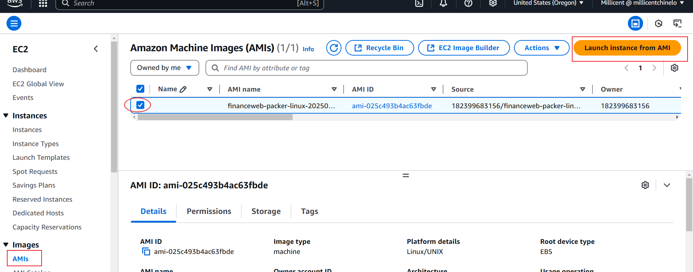

## Specification for the instance for this project:
- Name: finance_website
- Instance type: t2 micro
- key pair: add key pair incase you need to ssh into the instance to troubleshoot.
- Security group: It should allow ssh from port 22 and http from port 80

## **View Website Over the Internet**

Select the instance created to expose its details. Copy and paste the public ip address on a web browser.

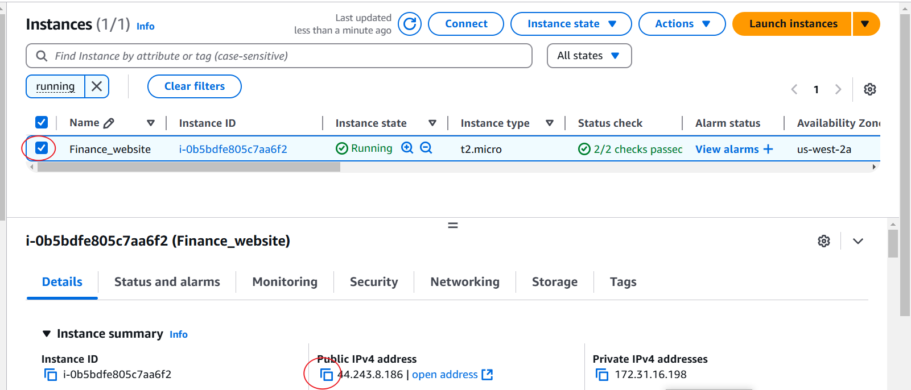


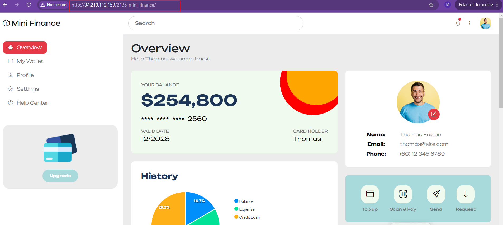


## **TROUBLESHOOTING**

1. Missing plugin error: When I first ran the "packer build" command, I got error that there was an important plugin that was supposed to be downloaded during packer initialization, but it was missing. I ran packer Init many times but it wasn't resolved.

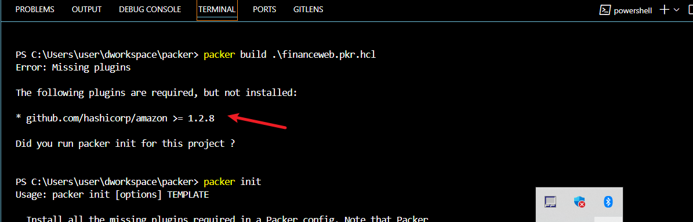

solution: I had to manual install it by running packer inatall

```
packer install github.com/hashicorp/amazon
```

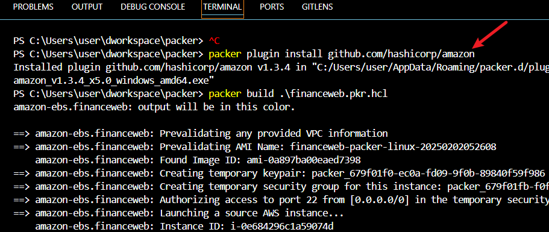


2. It works Error: When i pasted the public ip on the browser, The website was only showing "it work!" as it's content.

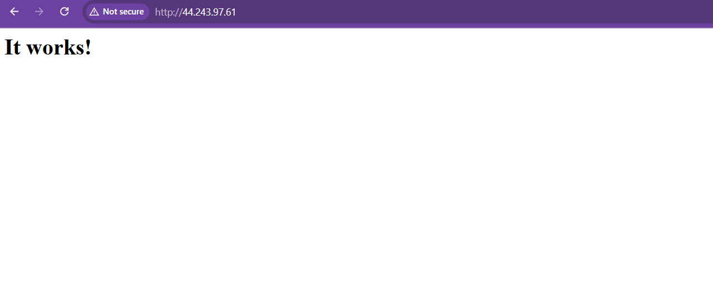

solution: i had to view the /var/www/html/ directory, which is the directory that houses the content of the file and i discovered it was empty. This was caused by an error in the spelling of the directory while copyng the files. 

```
ls -l /var/www/html/
```
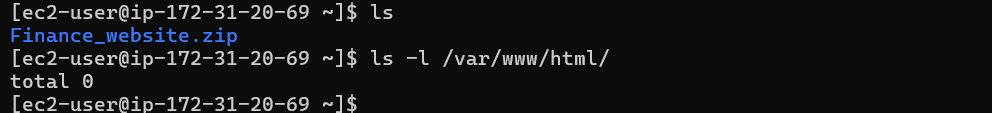

I corrected the spellings of the directories and ran the packer build command again which created a new AMI, which a used to deploy a new instance.

```
packer build financeweb.pkr.hcl
```


3. Webpage not reflecting the content of the index.html file: when accessing the deployed website on a web browser, it wasn't showing the actual content, rather, it showed "It Works"

Solution: I initially only pasted the public ip address of the website but the website needed to point to something (or a port), which in this project case, it was the name of the folder. To check what the website is pointing to, use the command:
```
ls -l /var/www/html
```
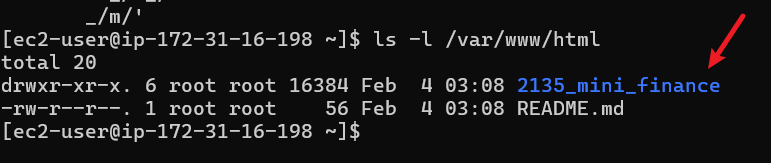

Then I pasted the public ip of the instance/the template name and the issue was resolved.

```
http://instance_public_ip/2135_mini_finance
```


