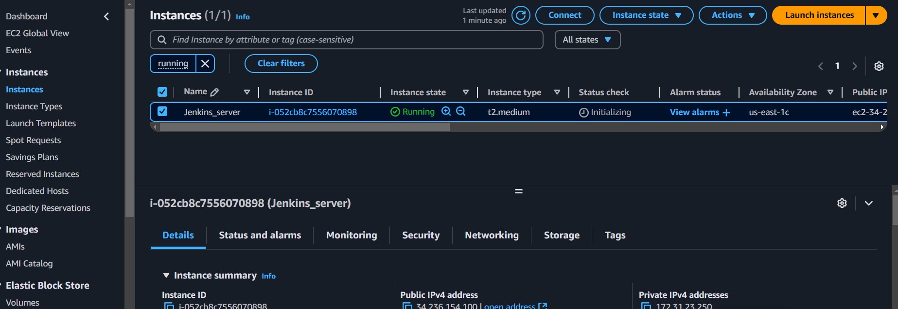
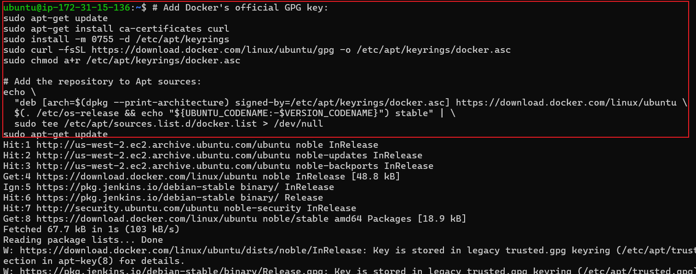
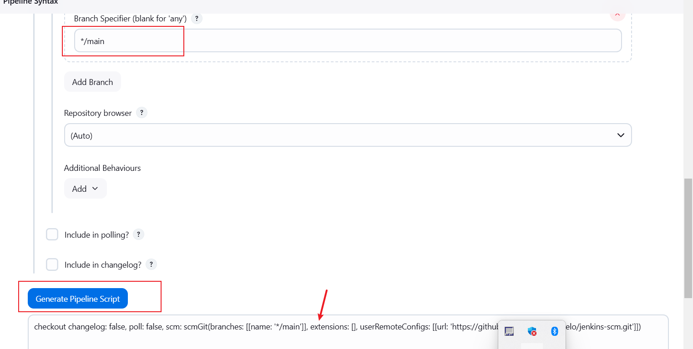
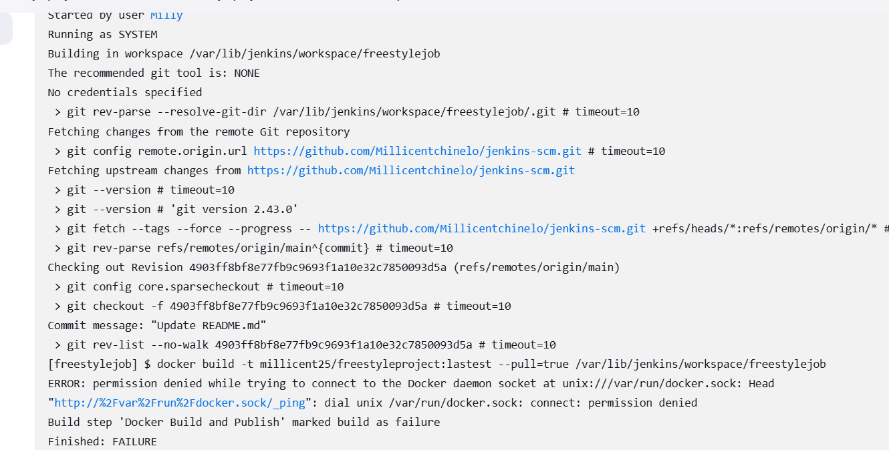

# Automating Deployment of an E-Commerce Website using Jenkins

Jenkins is widely employed as a crucial CI/CD tool for automating software development processes. Teams utilize Jenkins to automate building, testing, and deploying applications, streamlining the development lifecycle. With Jenkins pipelines, developers can define, version, and execute entire workflows as code, ensuring consistent and reproducible builds. Integration with version control systems allows Jenkins to trigger builds automatically upon code changes, facilitating early detection of issues and enabling teams to deliver high-quality software at a faster pace. Jenkins' flexibility, extensibility through plugins, and support for various tools make it a preferred choice for organizations aiming to implement efficient and automated DevOps practices.

## Jenkins Job
In Jenkins, a job is a unit of work or a task that can be executed by the Jenkins automation server.
A Jenkins job represents a specific task or set of tasks that needs to be performed as part of a build or deployment process. Jobs in Jenkins are created to automate the execution of various steps such as compiling code, running tests, packaging applications, and deploying them to servers. Each Jenkins job is configured with a series of build steps, post-build actions, and other settings that define how the job should be executed.
There are different types of jenkins job, but for this project, we will only use the freestyle and pipeline jobs.

## Project Scenario
A technology consulting firm, is adopting a cloud architecture for its software applications. As a DevOps Engineer, your task is to design and implement a robust CI/CD pipeline using both Jenkins freestyle job and jenkins pipeline to automate the deployment of a web application with Docker. The goal is to achieve continuous integration, continuous deployment, and ensure the scalability and reliability of the applications. 

# Setting Up Jenkins server
1. **Create an EC2 instance and ssh into it. Jenkins master is the central hub for managing jobs, configurations, and build processes, hence it requires 
higher compute and storage to work effectively. The configuration for the instance is as follows:**
  - T2 Medium
  - 30 GiB for root Volume
  - AMI is Ubuntu
  - Security group should allow custom TCP on port 8080 from anywhere, and ssh from your laptop ip address.




2. **To the Ec2 created with the above specifications, ssh into it and install jenkins using the below commands:**
 
```
sudo apt update
```
```
sudo wget -O /usr/share/keyrings/jenkins-keyring.asc \
  https://pkg.jenkins.io/debian-stable/jenkins.io-2023.key
echo "deb [signed-by=/usr/share/keyrings/jenkins-keyring.asc]" \
  https://pkg.jenkins.io/debian-stable binary/ | sudo tee \
  /etc/apt/sources.list.d/jenkins.list > /dev/null
sudo apt-get update
sudo apt-get install jenkins
```
 It is best practice to always get the lastest jenkins to install from [Jenkins official website](https://www.jenkins.io/doc/book/installing/linux/) 


3. **Confirm that Jenkins has been installed:**

```
sudo systemctl status jenkins
```


- On our Jenkins instance security group, ensure you created inbound rules for port 8080  as previously stated. By default, jenkins listens on port 8080, we need create an inbound rule for this in the security group of our jenkins instance


4. **Set up Jenkins On The Web Console**
    - Input your Jenkins Instance ip address on your web browser i.e. http://public_ip_address:8080


5. **On your Jenkins instance, check "/var/lib/jenkins/secrets/initialAdminPassword" to know your password**

```
sudo cat /var/lib/jenkins/secrets/initialAdminPassword
```


6. **Click on "install suggested plugins"**


7. **Fill the appropriate administrator details. It is important to use a strong password that you can remember. This is a must as it is the only way you can log back into your Jenkins as an admin.**


8. **For the instance configuration, leave the default value there and save.**


## Install docker
 Installing docker is necessary as we will be setting up our website using docker. On [docker's official website](https://docs.docker.com/engine/install/ubuntu/), check for latest commands for docker install on ubuntu machine. 
 
 + Copy and paste the below commands to install docker 

 ```
# Add Docker's official GPG key:
sudo apt-get update
sudo apt-get install ca-certificates curl
sudo install -m 0755 -d /etc/apt/keyrings
sudo curl -fsSL https://download.docker.com/linux/ubuntu/gpg -o /etc/apt/keyrings/docker.asc
sudo chmod a+r /etc/apt/keyrings/docker.asc

# Add the repository to Apt sources:
echo \
  "deb [arch=$(dpkg --print-architecture) signed-by=/etc/apt/keyrings/docker.asc] https://download.docker.com/linux/ubuntu \
  $(. /etc/os-release && echo "${UBUNTU_CODENAME:-$VERSION_CODENAME}") stable" | \
  sudo tee /etc/apt/sources.list.d/docker.list > /dev/null
sudo apt-get update
 ```

 ```
 sudo apt-get install docker-ce docker-ce-cli containerd.io docker-buildx-plugin docker-compose-plugin
 ```



+ Confirm the docker is installed

```
docker --version
```


+  Add the jenkins user to the docker group, to enable jenkins to run Docker commands directly. Restart jenkins to effect the new change and check Jenkins group to confirm docker has been added. This is a necessary step in configuring Jenkins for Docker-based workflows.

```
sudo usermod -aG docker jenkins
```
```
sudo systemctl restart jenkins
```
```
groups jenkins
```


## Jenkins Freestyle Project

1. From the dashboard menu on the left side, click on new item


2. Create a freestyle project and name it "freestyle_website"


3. Create a new github repository called jenkins-scm with a README.md file

    - Connect jenkins to jenkins-scm repository by pasting the repository url in the area selected below. Make sure your current branch is main


4. Connect source code to Jenkins
    - In the Source Code Management section, paste the http link from your github repository.
    - Input "main" as the branch
    
  

5. Automate the build:
    - In the build triggers section, select Github hook trigger for GitSCM polling. This will connect Github to trigger a new jenkins build once there is a commit on the main branch.


6. Under "add build Steps", select shell script
    - Add the below docker commands to build and run the docker image.
    ```
    docker build -t image-name .
    docker run -dp 8081:80 image-name

    ```

    - Click on save and then click on "Build now" to execute the just created job.


>>NOTE: Jenkins is already being accessed at port 8080, hence the website will have to be accessed via another port. In this case, we will be using port 8081 on this same ip address.

7. Edit Security group to allow custom tcp on port 8081 from anywhere

In order for the website to be accessed over the internet, we will have to give permission for its port to be accessed.


8. View webpage over the internet

    - Copy and paste the instance public ip address and include port 8081
    ```
    http://instance_public_ip:8081    
    ```


9. Initiate automation by creating a github webhook using jenkins ip address and port
    - In your GitHub repository, click on settings and select webhooks. Under payload url, input your jenkins url and port
    ```
    http://your_jenkins_url:8080/github-webhook/
    ```
    - Click on "add webhook"


10. Test Jenkins job is automated by editting your readme.md file
    - A new build will start once you commit the new edit.


## Pipeline Job
Jenkins Pipeline jobs provide a more powerful, flexible, and maintainable approach to automating CI/CD processes compared to Freestyle jobs. They support complex workflows, enhance collaboration, and facilitate better integration with modern development practices and tools.

An important component of pipelines is that it can be defined in a Jenkinsfile, hence it is reuseabe i.e you can create reusable components and functions in shared libraries, which can be used across multiple pipelines, reducing duplication and promoting best practices.

1. From the dashboard menu on the left side, click on new item


2. Name the pipeline as website_pipeline and click on "pipeline"


3. Automate the build
    - under triggers, select Github hook triggger for GitSCM polling to configure triggering the job from GitHub webhook. Note, we had earlier setup the webhook on our github repository, hence we won't need to set it up again since we are still using the same intance for this job


4. Write your pipeline script

A jenkins pipeline script refers to a script that defines and orchestrates the steps and stages of a continuous integration and continuous delivery (CI/CD) pipeline. Jenkins pipelines can be defined using either declarative or scripted syntax. Declarative syntax is a more structured and concise way to define pipelines. It uses a domain-specific language to describe the pipeline stages, steps, and other configurations while scripted syntax provides more flexibility and is suitable for complex scripting requirements.

    i. Under pipeline script, by your right, select Hello World to get a sample script and edit according to suit the requirements for your job. Expand the stage to suite the number of stages for this job


    ii. Configure the stages with the help of pipeline syntax. Click on pipeline syntax, it will open a new page, by your left, select Snippet Generator. The Snippet Generator will help define the individual steps in your pipeline.


    iii. Select the drop down to search for checkout: Check out from version control.  Select Git as the SCM and include the repository url. Ensure the include the branch will likely be main. Finally click on generate pipeline script.



    iv. Repeat the same steps for the shell script stages, but this time select "shell script" and input the shell commands and click ob generate pipeline script. After constructing the script, you click on save.


**Below is the final script:**

```
pipeline {
    agent any

    stages {
        stage('Connect To Github') {
            steps {
                checkout scmGit(branches: [[name: '*/main']], extensions: [], userRemoteConfigs: [[url: 'https://github.com/Millicentchinelo/jenkins-scm.git']])
            }
        }
        stage('Build Docker Image') {
            steps {
                script {
                    sh 'docker build -t dockerfile .'
                }
            }
        }
        stage('Run Docker Container') {
            steps {
                script {
                    sh 'docker run -itd -p 8081:80 dockerfile'
                }
            }
        }
    }
}

```
**Explanation of the script above**

Pipeline Definition:

- pipeline { ... }: This line defines the entire Jenkins pipeline.

Agent:

- agent any: This specifies that the pipeline can run on any available agent. It allows Jenkins to use any of its nodes to execute the stages.

Stages:

- stages { ... }: This block contains all the different stages of the pipeline.

Stage 1: Connect To Github

```
stage('Connect To Github') {
    steps {
        checkout scmGit(branches: [[name: '*/main']], extensions: [], userRemoteConfigs: [[url: 'https://github.com/Millicentchinelo/jenkins-scm.git']])
    }
}
```
**Stage Name: Connect To Github**

Purpose: This stage is responsible for checking out the code from a specified GitHub repository.

Steps:

- checkout scmGit(...): This command uses the scmGit plugin to check out the code.

    - branches: [[name: '*/main']]: This specifies that the pipeline should check out the main branch.

    - userRemoteConfigs: [[url: 'https://github.com/RidwanAz/jenkins-scm.git']]: This is the URL of the GitHub repository to clone.

**Stage 2: Build Docker Image**

```
stage('Build Docker Image') {
    steps {
        script {
            sh 'docker build -t dockerfile .'
        }
    }
}
```

Stage Name: Build Docker Image

Purpose: This stage builds a Docker image from the Dockerfile located in the repository.

Steps:

- script { ... }: This block allows for the execution of scripting commands.

- sh 'docker build -t dockerfile .': This line runs a shell command to build the Docker image.

    - docker build: The Docker command to build an image.

    - -t dockerfile: This tags the image with the name dockerfile.

    - .: This specifies that the build context is the current directory (where the Dockerfile is located).

**Stage 3: Run Docker Container**

```
stage('Run Docker Container') {
    steps {
        script {
            sh 'docker run -itd -p 8081:80 dockerfile'
        }
    }
}
```

Stage Name: Run Docker Container

Purpose: This stage runs a Docker container from the previously built image.

Steps:

- script { ... }: Similar to the previous stage, this allows for executing shell commands.

- sh 'docker run -itd -p 8081:80 dockerfile': This line runs a shell command to start a Docker container.

    - docker run: The Docker command to create and run a container.

    - -itd: This flag combination allows you to run the container in interactive mode (-i), allocate a terminal (-t), and run it in detached mode (-d).

    - -p 8081:80: This maps port 80 of the container to port 8081 on the host machine.

    - dockerfile: This specifies the image to use for the container.

5. Automate the README.md file or manually click on build now to start the new build.

6. To access the content of index.html on our web browser, you need to first ensure inbound rules are open to the port we mapped our container to (8081)

7. Access the content of index.html on our web browser

```
http://jenkins-ip-address:8081
```


## TROUBLESHOOTING

1. Docker permission Error: Error occured because Jenkins did not have permission to run docker command.



**Solution:**  Add jenkins to Docker group and restart jenkins. View the docker group to ensure jenkins has been added to the group

```
sudo usermod -aG docker jenkins
sudo systemctl restart jenkins
```
```
#check the jenkins group 
groups jenkins

```

OR

```
sudo grep docker /etc/group
```


2. It is important to ensure the security group is set to allow the right traffic from the right port. Once you see a "connection timed out" error, It is a security group permission issue.
